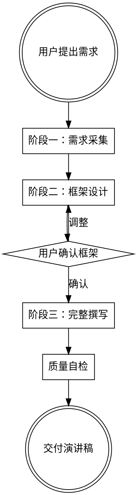

# 中文演讲撰写

## 概述

帮助撰写符合中文语言艺术的演讲稿。与西方演讲强调"hook-body-call to action"的套路不同，好的中文演讲讲究"理、气、势"三位一体。

**核心理念：** 以理服人、以情动人、以文化人

**三大要素（优先级排序）：**
1. **理**：逻辑层层递进，让人觉得"确实是这样"
2. **气**：一条主线贯穿始终，气韵连贯不散
3. **势**：疏密有致、起伏自然，重要处展开、过渡处简洁

**修辞优先级：**
1. 比喻类比（让人听懂）
2. 设问反问（引导思考）
3. 引经据典（增加厚度）
4. 对仗排比（形式美感）

## 工作流程



### 阶段一：需求采集

通过5个核心问题了解演讲需求：

1. **场合与受众** - 什么场合？听众是谁？他们关心什么？
2. **核心目的** - 你希望听众听完后记住什么？做什么？感受什么？
3. **主要观点** - 你想传达的核心观点是什么？（可以是粗略的要点）
4. **风格倾向** - 偏正式还是轻松？偏理性还是感性？有没有想参考的风格？
5. **时长限制** - 多长时间？（用于控制篇幅和节奏）

### 阶段二：框架设计

根据采集的信息，输出：

```
演讲框架：[演讲主题]

【主线提炼】
一句话概括：[整篇演讲的核心主线]

【结构选择】
采用结构：[起承转合 / 层层递进 / 总分总]
选择原因：[为什么这个结构适合这个内容]

【段落规划】

┌─────────────────────────────────────────────────────────┐
│ 第一部分：[部分名称]                                      │
├─────────────────────────────────────────────────────────┤
│ 核心任务：[这部分要完成什么]                               │
│ 核心观点：[这部分要传达什么]                               │
│ 情绪定位：[平稳/紧张/高潮/舒缓]                            │
│ 节奏：[疏/密]                                            │
└─────────────────────────────────────────────────────────┘

┌─────────────────────────────────────────────────────────┐
│ 第二部分：[部分名称]                                      │
├─────────────────────────────────────────────────────────┤
│ ...                                                     │
└─────────────────────────────────────────────────────────┘

【情绪曲线】
开场 → [情绪] → 第一部分 → [情绪] → ... → 结尾 → [情绪]

【伏笔设计】
- 伏笔：[在哪里埋下什么伏笔]
- 回收：[在哪里回收这个伏笔]

【首尾呼应设计】
- 开头：[开头的核心意象/概念/问题]
- 结尾：[如何回扣开头，形成闭环]
```

### 阶段三：完整撰写

框架确认后，展开成完整演讲稿：

```
演讲稿：[演讲主题]

预计时长：[X分钟]
字数：[X字]

---

[完整演讲文字]

[PAUSE] - 停顿标记
[情绪：平稳/上扬/低沉] - 情绪提示
[节奏：放慢/加快] - 节奏提示

---

【演讲备注】
- 情绪曲线回顾
- 高潮点标注
- 练习建议
```

## 撰写方法论

### 零、姿态（最重要）

**核心原则：** 不要"发表演讲"，要"和大家聊聊"。

**方法：**

**1. 不要端着**
- 演讲不是宣读文件，是和听众对话
- 语气要像在和朋友聊天，不是在台上训话
- ❌ "今天我想和大家分享三个重要的观点"
- ✅ "今天我想聊聊最近一直在想的一个问题"

**2. 适当自嘲**
- 自嘲可以打破距离感，让听众觉得你是"自己人"
- 特别是引用名人名言、古文典故时，自嘲可以避免"装"的感觉
- ❌ "王阳明的四句教给了我很大的启发"（端着）
- ✅ "今年我办公室挂了王阳明的四句教，这么说会不会有点中年油腻"（自嘲破冰）

**3. 真诚但不沉重**
- 可以讲严肃的话题，但不要一直绷着
- 可以反思，但不要变成忏悔大会
- 该轻松的地方轻松，该严肃的地方严肃

**4. 避免说教感**
- 不要"我来告诉你们一个道理"
- 而是"我最近在想一个问题，和大家聊聊"
- 用"比如"、"我的理解是"来引出观点，而不是直接下结论

### 一、理（逻辑层）

**核心原则：** 让听众觉得"确实是这样"，而不是"你说得对但我不信"。

**方法：**

**1. 主线先行**
在动笔前，用一句话回答"这篇演讲到底要说什么"。所有内容都要服务于这条主线。

**2. 层层递进**
观点之间要有推导关系，不是并列堆砌。
- ❌ "第一点是A，第二点是B，第三点是C"
- ✅ "因为A，所以B；既然B，那么C"

**3. 每段一个任务**
每个段落只完成一个逻辑任务：
- 提出问题
- 分析原因
- 给出方案
- 回应质疑
- 总结升华

不要在一个段落里混杂多个任务。

**4. 过渡要自然**
段落之间要有承接，但过渡要简洁，不要解释"为什么要过渡"：
- ❌ "这种能力在今天尤其重要，因为我们正在经历一个巨大的变化"（解释太多）
- ✅ "过去已去，未来已来"（简洁有力）

**好的过渡方式：**
- 设问过渡："那我们的价值在哪里？"
- 简洁转折："但问题来了"
- 时间切换："过去已去，未来已来"
- 自然延伸："这个道理，对公司和个人都一样"

**差的过渡方式：**
- 预告式："接下来我要讲的是..."
- 解释式："这种能力之所以重要，是因为..."
- 刻意埋伏笔："这个概念请大家先记住，后面我还会讲到"

### 二、气（贯通层）

**核心原则：** 整篇演讲要有一股劲儿从头贯到尾，不是碎片的拼凑。

**方法：**

**1. 一条主线**
全篇只有一个核心主题，所有内容都是这条主线的展开。
- 自检方法：删掉任何一段，主线会不会断？如果不会断，说明这段是多余的。

**2. 首尾呼应**
结尾要回扣开头，形成闭环。
- 不是简单重复开头的话
- 而是在经历了中间的论述后，让开头的话有了更深的含义

**3. 伏笔与回收**
前面埋下的点，后面要收回来。
- 如果开头提了一个概念/问题/故事，后面一定要再提到它
- 让听众有"原来如此"的感觉

**4. 段落之间有"接力"**
每段结尾要自然引出下一段，不能硬切。
- 可以用问句引出
- 用"但是"转折
- 用"不仅如此"递进

### 三、势（节奏层）

**核心原则：** 疏密有致、起伏自然，让听众的注意力有张有弛。

**方法：**

**1. 疏密有致**
- **密（展开）**：核心观点、关键转折、情感高点——要慢、要细、要让听众停下来想
- **疏（简洁）**：背景铺垫、过渡衔接、次要信息——要快、要简、不要恋战

**2. 情绪曲线设计**
在动笔前画出情绪曲线：
```
开场（平稳）→ 问题抛出（紧张）→ 分析展开（平稳）
→ 核心观点（高潮）→ 如何行动（平稳）→ 展望收尾（昂扬）
```

**3. 高潮的处理**
- 高潮前要有铺垫（蓄势）
- 高潮处要放慢、要停顿、要让那句话"落地"
- 高潮后要有收（不能一直高）
- 一篇演讲最多1-2个高潮

**4. 停顿的艺术**
停顿不是没话说，而是让听众消化。
- 重要观点前停顿（让听众准备好接收）
- 重要观点后停顿（让观点沉淀）

## 修辞技巧

### 一、比喻类比（优先级最高）

**目的：** 用具象的东西解释抽象的道理，让人"秒懂"。

**原则：**
- 比喻要贴近听众的生活经验
- 一个比喻贯穿到底，不要中途换喻体
- 比喻是为了说清楚道理，不是为了显得有文采

**示例：**
- ❌ "我们要像雄鹰一样翱翔"（空洞、俗套）
- ✅ "AI就像计算器。计算器出现后，会算数的人没有失业，但只会算数的人失业了"（具体、有洞察）

### 二、设问反问（优先级第二）

**目的：** 引导听众思考，制造互动感。

**用法：**
- **设问**：自问自答，用于引出观点。"那怎么办呢？我的答案是..."
- **反问**：不需要回答，用于强调。"难道我们要坐以待毙吗？"
- **连续追问**：层层深入。"为什么会这样？是因为X。那X又是怎么来的？"

**节奏技巧：**
- 问完要停顿，给听众思考的时间
- 不要连续问太多问题（超过3个会让人烦）

### 三、引经据典（优先级第三）

**目的：** 增加文化厚度，借古人之口说自己的话。

**原则：**
- 引用要自然，不能为了引用而引用
- 引用后要解释、要和自己的观点连接
- 不要引用太生僻的典故

**示例：**
- ❌ "子曰：学而时习之，不亦说乎。所以我们要学习。"（生硬）
- ✅ "王阳明讲'知善知恶'，意思是我们要有能力分辨什么是对的、什么是错的。这听起来简单，但做起来很难——因为我们总是倾向于把自己的成功归因于能力，而不愿意承认其中有多少是运气。"（有解释、有延伸）

### 四、对仗排比（优先级第四）

**目的：** 增强节奏感和记忆点，用于强调。

**原则：**
- 用在高潮处、总结处，不要通篇都是
- 三句为佳（两句太少，四句太多）
- 内容要有递进或对比，不能只是形式工整

**示例：**
- ❌ "我们要努力，我们要奋斗，我们要拼搏，我们要进取"（堆砌、空洞）
- ✅ "AI可以写代码，但AI不会为bug负责；AI可以做方案，但AI不会为效果负责；AI可以分析数据，但AI不会为决策负责。"（有内容、有递进）

## 风格适配

### 根据场合选择风格

| 场合 | 风格倾向 | 语言特点 | 修辞侧重 |
|-----|---------|---------|---------|
| **年会/内部动员** | 企业家 + 学者 | 真诚、有温度、适度口语化 | 比喻、设问、适当引经据典 |
| **行业论坛/外部演讲** | 学者风格为主 | 专业、有洞察、有文化厚度 | 引经据典、比喻、数据支撑 |
| **产品发布/商业路演** | 企业家风格为主 | 简洁、有力、节奏快 | 比喻、排比、制造记忆点 |
| **颁奖/庆典/致辞** | 正式风格 | 考究、有仪式感 | 对仗、引经据典、情感表达 |
| **培训/分享** | 学者风格 | 娓娓道来、有逻辑 | 设问、比喻、案例 |

### 根据受众调整

| 受众 | 调整方向 |
|-----|---------|
| **基层员工** | 少用抽象概念，多用具体案例；少讲"为什么"，多讲"怎么做" |
| **管理层** | 可以更抽象、更战略；强调逻辑和洞察 |
| **外部客户** | 专业但不炫技；重点是"对你有什么价值" |
| **混合受众** | 用比喻让所有人都能听懂；核心观点要简单有力 |

### 时长与节奏对应

| 时长 | 结构建议 | 节奏特点 |
|-----|---------|---------|
| **5分钟以内** | 一个核心观点 + 一个支撑 | 快节奏，直奔主题 |
| **10分钟** | 一个核心观点 + 2-3个支撑 | 有起伏，一个高潮 |
| **20分钟** | 一个核心观点 + 3-4个支撑 | 疏密交替，1-2个高潮 |
| **30分钟以上** | 需要分段，每段有小结 | 必须有"休息点" |

## 质量检查清单

### 理（逻辑）检查
- [ ] 能否用一句话说清楚这篇演讲的主线？
- [ ] 每个段落是否只完成一个逻辑任务？
- [ ] 段落之间是否有推导关系而非并列堆砌？
- [ ] 删掉任何一段，主线会不会断？

### 气（贯通）检查
- [ ] 开头和结尾是否呼应？
- [ ] 前面埋的伏笔后面是否收回来了？
- [ ] 段落之间的过渡是否自然？

### 势（节奏）检查
- [ ] 重要的地方是否展开了？次要的地方是否简洁了？
- [ ] 情绪曲线是否有起伏？高潮在哪里？
- [ ] 高潮处是否有停顿让观点"落地"？

### 修辞检查
- [ ] 比喻是否贴近听众的生活经验？
- [ ] 引用是否有解释和延伸？
- [ ] 排比是否有内容递进而非形式堆砌？

### 口语化检查
- [ ] 读出来是否自然？有没有"书面腔"？
- [ ] 句子是否太长？（超过30字的句子要拆分）
- [ ] 有没有听众听不懂的术语或典故？
- [ ] 有没有用口语连接词？（"但anyways"、"比如"、"那"）
- [ ] 有没有"翻译腔"句式？（"不只是...更是..."、"让我们..."）

### 姿态检查
- [ ] 是在"聊天"还是在"宣读"？
- [ ] 有没有适当的自嘲或轻松的地方？
- [ ] 引用典故时有没有"装"的感觉？
- [ ] 过渡是否简洁？有没有解释"为什么要过渡"？

## 常见错误

| 错误 | 表现 | 修正方法 |
|-----|------|---------|
| **端着/装** | 语气像在"发表重要讲话"，引用典故时显得刻意 | 加入自嘲，用"聊天"的语气而非"宣读"的语气 |
| **碎片化** | 观点之间没有逻辑关系，像是拼凑的 | 重新梳理主线，确保每段都服务于主线 |
| **节奏平** | 从头到尾一个调，没有起伏 | 画出情绪曲线，标注高潮点，调整疏密 |
| **翻译腔** | "让我们..."、"我想说的是..."、"最后但同样重要的是..." | 改成自然的中文表达 |
| **过渡刻意** | "这种能力之所以重要..."、"请大家先记住，后面会讲到" | 过渡要简洁，不要解释为什么要过渡 |
| **堆砌修辞** | 排比套排比，引用接引用 | 删减，只在关键处使用 |
| **首尾不呼应** | 结尾和开头没有关系 | 结尾回扣开头，形成闭环 |
| **伏笔不收** | 前面提了一个概念/问题，后面再没提 | 要么删掉伏笔，要么补上回收 |
| **高潮太多** | 处处都想强调，结果处处都不强调 | 一篇演讲最多1-2个高潮 |
| **观点空洞** | 只有口号没有内容 | 每个观点都要有具体的支撑（案例/数据/逻辑） |
| **清单式表达** | "第一...第二...第三..."的并列堆砌 | 用一个完整的句子把要素串起来，一气呵成 |