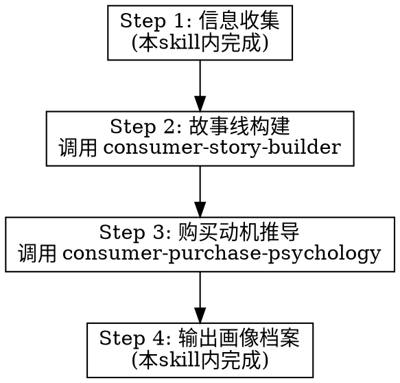

# 中国消费人群深度洞察 — 主调度

## Overview

传统营销画像停留在"25-35岁女性白领"这种标签层面。本框架还原一个有血有肉的人——他从哪里来，经历了什么时代，走过哪些人生岔路口，现在处于什么状态，内心深处在为什么焦虑——然后回答一个根本问题：**他掏钱的那一刻，到底在为什么买单？**

方法论基础：社会学（费孝通差序格局、布迪厄文化资本）、消费心理学（Sheth-Newman-Gross消费价值理论）、认知心理学（Kahneman双系统理论、前景理论）、社会心理学（Cialdini社会影响、Festinger社会比较）、传播学

## When to Use

- 为品牌/产品制定营销策略之前，需要深度理解目标人群
- 需要为视频脚本/分镜设计找到精准的情感切入点
- 需要区分购买人群和使用人群，理解购买决策中的社会关系动力
- 需要把"目标用户是年轻女性"这种粗糙画像拆解为有故事线的细分人群

## 工作流程



---

## Step 1：信息收集

**目标：** 明确要分析的产品/品牌/场景的基本参数

| 信息维度 | 关键问题 | 为什么需要 |
|---------|---------|-----------|
| **品类** | 什么类型的产品/服务？ | 决定从哪些消费心理框架入手 |
| **价格带** | 客单价多少？什么消费层级？ | 筛选有购买力的代际和阶层 |
| **使用场景** | 什么场景下使用？独自/社交/家庭？ | 判断个人消费还是关系消费 |
| **品牌定位** | 高端/大众/性价比/小众？ | 匹配对应的身份建构需求 |
| **现有用户画像** | 现有数据显示谁在买？ | 作为验证和拓展的起点 |
| **营销目标** | 拉新/提频/提客单/进入新市场？ | 决定洞察的产出方向 |
| **投放渠道** | 抖音/小红书/微信/线下？ | 影响人群故事线的叙述方式 |

**追问优先级：** 品类和价格带（必须）→ 使用场景 → 营销目标 → 其他可合理假设

---

## Step 2：故事线构建

**调用 `consumer-story-builder` skill。**

将 Step 1 收集的信息传入，该 skill 会：
1. 从代际画像库、地域文化圈、时代岔路口矩阵中匹配相关维度
2. 交叉生成 4-8 个候选人群
3. 为每个人群生成完整故事线（成长背景 → 岔路口选择 → 当前状态 → 核心焦虑与渴望）

---

## Step 3：购买动机推导

**调用 `consumer-purchase-psychology` skill。**

将 Step 2 产出的人群故事线传入，该 skill 会：
1. 分析每个人群的社会关系网络和购买-使用关系
2. 推导六种买单对象中的匹配项
3. 识别底层心理需求和决策机制
4. 找到情感连接点（The Hook）

---

## Step 4：输出画像档案

将 Step 2 和 Step 3 的结果整合，按以下模板输出 **3-6 个细分人群画像**：

```
═══════════════════════════════════════════
人群档案 #[编号]：[人群命名]
一句话描述：[用一句话概括这是什么样的人]
═══════════════════════════════════════════

▎基本坐标
  代际：[X后]
  地域/城市层级：[文化圈] × [城市层级]
  关键岔路口：[走过的关键岔路口及选择]
  当前人生阶段：[婚姻状态/职业状态/家庭状态]

▎成长故事线（3-5句话）
  [以第三人称叙述的成长背景——不是统计描述，是有画面感的故事]

▎当前状态快照
  · 职业：[做什么/收入水平/满意度]
  · 家庭：[婚姻/子女/父母]
  · 经济：[资产/负债/财务安全感]
  · 情绪基调：[日常情绪状态的一句话描述]

▎核心焦虑与渴望
  · 显性焦虑：[他自己知道的]
  · 隐性焦虑：[他不会说的]
  · 显性渴望：[他公开追求的]
  · 隐性渴望：[他秘密想要的]

▎消费心理画像
  · 真实买单对象：[六种中的哪种]
  · 被激活的底层需求：[七种中的哪个]
  · 主导决策机制：[哪种心理机制在起作用]
  · 心理账户归类：[这个产品在他心里属于哪个账户]

▎购买-使用关系
  · 购买者：[谁] — 动机：[什么]
  · 使用者：[谁] — 态度：[什么]
  · 关键影响者：[谁] — 影响方式：[什么]
  · 决策触发场景：[什么场景下会触发购买]

▎情感连接点（The Hook）
  · 能打动他的一句话：[如果只能说一句话]
  · 能触动他的画面：[如果只能呈现一个画面]
  · 绝对不能踩的雷区：[什么表达会让他反感]

▎营销策略建议
  · 内容调性：[语言风格和情绪]
  · 渠道偏好：[什么平台/场景最容易触达]
  · KOL/KOC匹配：[什么样的人能影响他]
  · 促转化关键：[最后一步"下单"需要什么推力]
═══════════════════════════════════════════
```

---

## 使用注意事项

1. **不要追求"覆盖所有人"。** 3-6个精准的细分人群 > 一个模糊的"目标人群"
2. **购买者和使用者的区分是强制性的。** 每个画像都必须明确两者关系
3. **"他在为什么买单"是核心产出。** 分析完了还不能回答这个问题，分析就没有价值
4. **故事线要有画面感。** "28岁女性白领"不行。"从安徽小镇考到上海读大学、在外企做了三年市场、刚被裁员正在考虑要不要回老家相亲结婚的28岁姑娘"——这才是
5. **焦虑和渴望比收入和年龄更有营销价值**
6. **本框架是起点，不是终点。** 具体分析仍需结合行业数据、用户调研和品牌实际情况