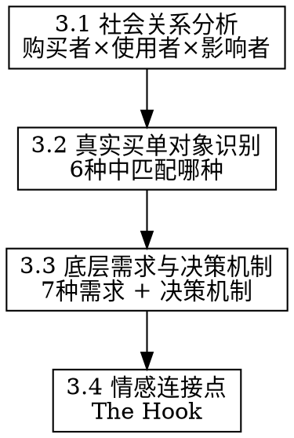

# 消费购买心理推导

## Overview

接收 `consumer-story-builder` 产出的人群故事线，回答一个根本问题：**这个人掏钱的那一刻，到底在为什么买单？**

**核心原则：** 同一产品，不同人群在为完全不同的东西买单。找到那个"真实买单对象"，才能找到情感连接点。

## 工作流程



---

## 3.1 社会关系分析

**强制步骤：** 每个人群必须明确区分购买者和使用者。

| 角色 | 关键问题 |
|------|---------|
| 购买者 | 谁掏钱？动机是什么？ |
| 使用者 | 谁用？对购买的态度？ |
| 关键影响者 | 谁能影响购买决策？怎么影响？ |
| 决策触发场景 | 什么场景下会触发购买行为？ |

**参考知识库：** 读取同目录 `social-relations.md`，查阅对应代际的家庭结构、婚姻市场、同辈压力、社区归属特征。

**常见购买-使用分离模式：**
- 父母为子女买（礼物/教育/健康）
- 子女为父母买（孝顺/补偿）
- 自己买给"想成为的自己"（身份建构）
- 为维护关系买（送礼/面子/从众）

---

## 3.2 真实买单对象识别

从以下6种中选择1-2个主导项（每种的详细特征、代际场景、营销含义见 `purchase-psychology-kb.md` 零章）：

| # | 买单对象 | 核心问题 | 典型信号 |
|---|---------|---------|---------|
| 1 | 解决一个问题（功能性） | 这个产品能帮我做什么？ | 比较参数、问效果、看评测 |
| 2 | 成为一种人（身份建构） | 用这个产品的人是什么样的人？ | 关注品牌调性、KOL是谁 |
| 3 | 维护一段关系（社会关系） | 买这个能让关系更好吗？ | 送礼场景、从众行为 |
| 4 | 获得一种感受（情绪价值） | 买/用这个让我感觉怎样？ | 冲动购买、仪式感消费 |
| 5 | 消除一种恐惧（安全感） | 不买会怎样？买了能放心吗？ | 焦虑驱动、保险型消费 |
| 6 | 弥补一种缺失（补偿心理） | 这个能给我曾经没有的东西吗？ | 童年缺失、阶层跨越渴望 |

**判断方法：** 结合人群故事线的"核心焦虑与渴望"模块，焦虑对应5（消除恐惧），渴望对应2/4/6，关系型人群对应3。

---

## 3.3 底层需求与决策机制

**参考知识库：** 读取同目录 `purchase-psychology-kb.md`，查阅：
- 7种底层心理需求的详细描述和识别信号
- 7种决策机制（损失厌恶、心理账户、符号消费等）的触发条件
- 体制因素对消费心理的影响（体制内外、户籍、独生子女）

**快速识别表：**

| 人群特征 | 可能激活的底层需求 | 主导决策机制 |
|---------|-----------------|------------|
| 阶层上升焦虑 | 归属感/地位认同 | 符号消费/社会比较 |
| 体制内稳定 | 安全感/秩序感 | 损失厌恶/从众 |
| 小镇青年进城 | 身份重建/归属感 | 符号消费/补偿心理 |
| 独生子女中产 | 自我实现/情绪价值 | 享乐主义/心理账户 |
| 父母为子女 | 爱与连接/安全感 | 损失厌恶/社会比较 |
| 职场压力大 | 情绪调节/掌控感 | 即时满足/心理账户 |

---

## 3.4 情感连接点（The Hook）

基于前三步，为每个人群提炼：

```
· 能打动他的一句话：[如果只能说一句话，说什么]
· 能触动他的画面：[如果只能呈现一个画面，是什么]
· 绝对不能踩的雷区：[什么表达会让他反感或防御]
```

**雷区识别逻辑：**
- 买单对象是"身份建构"的人 → 不能显得"廉价"或"大众"
- 买单对象是"消除恐惧"的人 → 不能轻描淡写他的焦虑
- 购买者≠使用者时 → 不能只对使用者说话，忽略购买者的动机

---

## 产出格式

为每个人群输出消费心理画像，供 `consumer-deep-insight` Step 4 整合：

```
▎消费心理画像
  · 真实买单对象：[6种中的哪种，一句话说明为什么]
  · 被激活的底层需求：[7种中的哪个]
  · 主导决策机制：[哪种心理机制在起作用]
  · 心理账户归类：[这个产品在他心里属于哪个账户]

▎购买-使用关系
  · 购买者：[谁] — 动机：[什么]
  · 使用者：[谁] — 态度：[什么]
  · 关键影响者：[谁] — 影响方式：[什么]
  · 决策触发场景：[什么场景下会触发购买]

▎情感连接点（The Hook）
  · 能打动他的一句话：[...]
  · 能触动他的画面：[...]
  · 绝对不能踩的雷区：[...]
```