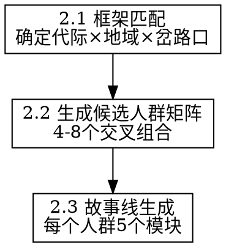

# 消费人群故事线构建

## Overview

将产品信息转化为有血有肉的细分人群故事线。通过代际画像、地域文化圈、时代岔路口三个维度的交叉匹配，生成 4-8 个候选人群，并为每个人群构建从"出生到现在"的完整叙事。

**核心原则：** 故事线不是统计描述，是"他看到的世界长什么样"。

## When to Use

被 `consumer-deep-insight` 在 Step 2 调用，接收产品/品牌基本参数，产出细分人群故事线。

## 工作流程



---

## 2.1 框架匹配

根据产品参数，从三个知识库中筛选最相关的维度。

### 确定核心代际段（选 2-4 个）

判断逻辑：
- 价格带 → 筛出有购买力的代际（注意：购买者可能不是使用者）
- 使用场景 → 筛出有使用需求的代际
- 品类生命周期 → 新品类倾向年轻代际，成熟品类跨代际

**参考知识库：** 读取同目录 `generational-profiles.md`，查阅对应代际的共同时代背景、城市/小镇体感、核心焦虑、消费特征。

### 确定核心地域圈（选 2-3 个）

判断逻辑：
- 品牌定位高端 → 聚焦一线+新一线
- 品牌定位大众 → 关注城市层级差异
- 品牌有地域特征 → 匹配对应文化圈
- 线上投放 → 地域因素弱化但不消失

**参考知识库：** 读取同目录 `regional-cultures.md`，查阅对应文化圈的经济底色、文化DNA、"好人生"定义、消费特征。

### 确定关键岔路口（选 2-3 个）

判断逻辑：
- 每个代际有 1-2 个"命运级"岔路口（几乎每个人都被影响）
- 选择与产品品类最相关的岔路口

**参考知识库：** 读取同目录 `era-forks.md`，查阅对应岔路口的分支路径、当前状态、消费关联。

### 代际-岔路口速查表

| 代际 | 命运级岔路口 |
|------|------------|
| 60后 | 恢复高考、改革开放个体户潮 |
| 65后 | 92南巡下海潮 |
| 70后 | 国企改制下岗潮、98房改低价买房 |
| 75后 | WTO外企黄金期 |
| 80后 | 大学扩招、05-10房价飙升 |
| 85后 | 移动互联网爆发、大众创业、15-16最后上车 |
| 90后 | 留守儿童经历、短视频崛起 |
| 95后 | 考公热回潮、疫情三年 |
| 00后 | 经济下行期就业、疫情贯穿大学 |

---

## 2.2 生成候选人群矩阵

将筛选结果交叉，生成 4-8 个细分人群：

```
候选人群矩阵
├── 人群A：[代际] × [地域/城市层级] × [岔路口选择]
├── 人群B：...
├── 人群C：...
└── 人群D：...
```

**交叉原则：**
- 不是所有排列组合，而是选择"最有张力"的组合——内心冲突越大，消费动机越强
- 同一代际内，城市线和小镇线至少各保留一个（体感差异巨大）
- 优先保留"购买者≠使用者"可能性高的组合

---

## 2.3 故事线生成

为每个候选人群生成 5 个模块：

### 模块 1：成长背景叙事

用 2-3 句话勾勒成长环境——不是统计数据，是"他看到的世界长什么样"。

要素：
- 出生在什么样的家庭（父母职业、兄弟姐妹、经济状况）
- 成长的物理环境（城市/小镇/农村、几线城市、什么文化圈）
- 成长期的时代氛围（那几年中国在发生什么、他能感知到什么）

### 模块 2：关键岔路口与选择

列出 2-3 个关键岔路口，每个写明：
- 他的选择（主动还是被迫）
- 这个选择如何塑造了他今天的状态

### 模块 3：当前状态快照

用"典型一天"或"典型一周"呈现：
- 职业状态（做什么、收入、满意度）
- 家庭状态（婚姻、子女、父母）
- 经济状态（有房/无房、负债、财务安全感）
- 情绪状态（主要焦虑/期望/日常情绪基调）

### 模块 4：核心焦虑与渴望

- 显性焦虑（他自己知道并可能说出来的）
- 隐性焦虑（他不会说但行为中体现的）
- 显性渴望（他愿意公开追求的）
- 隐性渴望（他觉得"不该有"但确实存在的）

### 模块 5：与产品的初步连接

这个人的生活中，这个产品/品类可能出现在什么场景？他第一反应是什么？

---

## 产出格式

每个人群的故事线按以下格式输出，供 `consumer-purchase-psychology` 在下一步使用：

```
── 人群 [编号]：[命名] ──
代际：[X后] | 地域：[文化圈×城市层级] | 岔路口：[关键选择]

【成长背景】
[2-3句画面感叙述]

【岔路口选择】
· [岔路口1]：[选择] → [影响]
· [岔路口2]：[选择] → [影响]

【当前状态】
· 职业/收入/家庭/经济/情绪 各一句

【焦虑与渴望】
· 显性焦虑：...
· 隐性焦虑：...
· 显性渴望：...
· 隐性渴望：...

【与产品的初步连接】
[一段话描述产品在他生活中可能出现的场景]
```