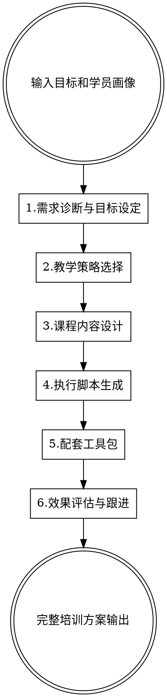

# 互动培训课程设计

## 概述

帮助企业内训设计者快速设计商学院式互动培训课程，输出完整的课程方案、执行脚本和配套工具包。

**核心原则：** 以终为始（从目标倒推设计）、学员中心（根据画像调整方法）、可执行性（让任何合格主持人都能执行）。

## 使用方式

**输入：** 培训目标 + 学员画像
**输出：** 课程设计方案 + 执行脚本 + 配套工具包 + 评估方案



## 模块1：需求诊断与目标设定

**核心目标：** 搞清楚"为什么要做这个培训"和"学员是谁"。

**学员画像分析框架：**

| 维度 | 要了解的信息 | 影响的设计决策 |
|-----|------------|--------------|
| **基本信息** | 职级、岗位、工作年限 | 案例选择、语言风格 |
| **知识基础** | 对培训主题的了解程度 | 内容深度、是否需要铺垫 |
| **学习动机** | 主动报名 vs 被安排来的 | 开场设计、激发兴趣的方式 |
| **实际痛点** | 工作中遇到的真实问题 | 案例选择、讨论话题 |
| **学习偏好** | 喜欢听讲 vs 讨论 vs 动手 | 教学方法配比 |

**培训目标拆解（布鲁姆分类法）：**

```
目标层次（由低到高）：
├── 记忆：能说出关键概念和步骤
├── 理解：能用自己的话解释原理
├── 应用：能在模拟场景中正确操作
├── 分析：能识别问题并找到原因
├── 评估：能判断方案的优劣
└── 创造：能设计新的解决方案
```

**成功标准定义：**
- 培训结束时，学员能做到什么？（行为描述，可观察）
- 回到工作岗位后，期望看到什么变化？
- 如何验证培训是否成功？

**输出格式：**
```
需求诊断报告

【培训背景】
- 培训主题：
- 培训时长：
- 参训人数：
- 培训发起原因：

【学员画像】
- 基本信息：[职级/岗位/工作年限]
- 知识基础：[对主题的了解程度]
- 学习动机：[主动/被动]
- 实际痛点：[工作中的真实问题]
- 学习偏好：[听讲/讨论/动手]

【培训目标】
- 目标层次：[记忆/理解/应用/分析/评估/创造]
- 具体目标：[培训结束时学员能做到什么]
- 行为指标：[可观察的行为描述]

【成功标准】
- 课堂标准：[培训中如何判断成功]
- 应用标准：[回到岗位后期望的变化]
- 验证方式：[如何验证培训成功]
```

## 模块2：教学策略选择

**核心目标：** 根据培训目标和学员特点，选择最合适的教学方法组合。

**三种核心教学方法对比：**

| 方法 | 适用场景 | 优势 | 局限 |
|-----|---------|-----|------|
| **案例教学** | 培养分析判断能力、理解复杂情境 | 贴近真实、激发思考 | 需要高质量案例、引导技巧要求高 |
| **互动研讨** | 态度转变、经验分享、团队共识 | 参与度高、促进内化 | 容易跑题、结论质量不稳定 |
| **行动学习** | 解决真实问题、产出可落地方案 | 学以致用、成果可见 | 需要真实课题、周期较长 |

**教学方法选择矩阵：**

```
根据培训目标选择主导方法：

知识传递为主 → 讲授 + 案例分析
├── 适合：产品知识、流程规范、理论框架
└── 配比：讲授60% + 案例讨论30% + 练习10%

技能训练为主 → 演示 + 模拟练习
├── 适合：销售技巧、沟通技能、操作流程
└── 配比：演示20% + 练习50% + 反馈30%

态度/认知转变 → 体验 + 反思研讨
├── 适合：领导力、团队协作、变革管理
└── 配比：体验活动40% + 研讨反思40% + 总结20%

问题解决为主 → 行动学习
├── 适合：战略研讨、流程优化、创新项目
└── 配比：问题澄清20% + 方案研讨50% + 行动计划30%
```

**根据学员特点调整：**

| 学员特点 | 调整方向 |
|---------|---------|
| 新员工/经验少 | 增加讲授和演示，减少开放讨论 |
| 资深员工/管理者 | 减少讲授，增加研讨和经验分享 |
| 被动参与/动机低 | 增加互动和体验，减少单向讲授 |
| 时间紧张 | 聚焦核心内容，减少发散讨论 |

**输出格式：**
```
教学策略方案

【主导方法】
- 方法选择：[案例教学/互动研讨/行动学习/混合]
- 选择理由：[基于目标和学员特点]

【方法配比】
- 讲授：XX%
- 案例讨论：XX%
- 小组研讨：XX%
- 模拟练习：XX%
- 体验活动：XX%

【学员特点调整】
- 调整点：[具体调整内容]
- 调整理由：[基于学员画像]
```

## 模块3：课程内容设计

**核心目标：** 将培训目标转化为具体的内容结构、案例和互动环节。

**内容结构设计原则：**

```
黄金圈法则：
├── Why（为什么）→ 先讲意义和价值，激发学习动机
├── How（怎么做）→ 再讲方法和步骤
└── What（是什么）→ 最后补充概念和细节

认知负荷管理：
├── 单个模块不超过3个核心知识点
├── 每20分钟讲授后安排互动
└── 复杂内容先给框架再填细节
```

**案例设计标准：**

| 要素 | 好案例的特征 | 避免的问题 |
|-----|------------|----------|
| **相关性** | 与学员工作场景高度相似 | 太远离实际、无法代入 |
| **复杂度** | 有真实的两难选择和权衡 | 答案太明显、没有讨论空间 |
| **信息量** | 足够做分析但不过载 | 信息太少或太多 |
| **开放性** | 没有唯一正确答案 | 标准答案式的案例 |

**互动环节设计菜单：**

| 互动类型 | 适用场景 | 时长 | 人数要求 |
|---------|---------|-----|---------|
| **快速投票** | 了解观点分布、激活参与 | 2-3分钟 | 不限 |
| **两两讨论** | 初步思考、降低发言门槛 | 3-5分钟 | 不限 |
| **小组讨论** | 深度探讨、产出结论 | 10-20分钟 | 4-6人/组 |
| **角色扮演** | 技能练习、体验不同视角 | 15-30分钟 | 2-4人/组 |
| **案例分析** | 培养分析判断能力 | 20-40分钟 | 4-6人/组 |
| **世界咖啡** | 多话题轮转、汇集集体智慧 | 30-60分钟 | 15人以上 |

**输出格式：**
```
课程内容大纲

【整体结构】
- 模块数量：X个
- 总时长：X小时
- 核心知识点：X个

【模块详情】
模块1：[模块名称] - [时长]
├── 学习目标：[本模块结束时学员能做到什么]
├── 核心内容：[知识点1、知识点2、知识点3]
├── 教学方法：[讲授/案例/讨论/练习]
├── 互动环节：[具体互动设计]
└── 案例/素材：[使用的案例或素材]

【案例清单】
- 案例1：[案例名称] - [使用场景] - [讨论问题]
- 案例2：...
```

## 模块4：执行脚本生成

**核心目标：** 生成详细的分钟级执行脚本，让主持人能够顺利执行培训。

**执行脚本结构：**

```
每个环节的脚本包含：
├── 时间：开始时间、持续时长
├── 目标：这个环节要达成什么
├── 主持话术：开场白、过渡语、总结语
├── 引导问题：推动讨论的关键问题
├── 操作指引：PPT页码、道具准备、分组方式
├── 注意事项：常见问题、应对预案
└── 检查点：如何判断这个环节是否成功
```

**主持话术设计原则：**

| 场景 | 话术要点 | 示例 |
|-----|---------|-----|
| **开场破冰** | 建立连接、说明价值、管理预期 | "今天我们要解决一个大家都遇到过的问题..." |
| **导入新内容** | 承上启下、激发好奇 | "刚才我们讨论了X，接下来看看如何解决..." |
| **发起讨论** | 问题清晰、降低门槛 | "请先和旁边的同事聊2分钟，然后我们分享..." |
| **收拢讨论** | 提炼要点、补充遗漏 | "刚才大家提到了三个关键点..." |
| **处理冷场** | 降低难度、给出选项 | "换个角度问，如果你是客户，你会..." |
| **时间控制** | 温和提醒、保持节奏 | "还有2分钟，请各组准备总结..." |

**引导问题设计层次：**

```
问题漏斗（由浅入深）：
├── 事实层：发生了什么？你观察到什么？
├── 感受层：你的第一反应是什么？
├── 分析层：为什么会这样？背后的原因是什么？
├── 决策层：如果是你，你会怎么做？
└── 迁移层：这对我们的工作有什么启发？
```

**输出格式：**
```
执行脚本 - [培训主题]

=====================================
环节1：[环节名称]
时间：[开始时间] - [结束时间]（[X分钟]）
=====================================

【环节目标】
- [本环节要达成什么]

【主持话术】
开场：
"[具体话术]"

过渡：
"[具体话术]"

总结：
"[具体话术]"

【引导问题】
1. [问题1]
2. [问题2]
3. [备用问题]

【操作指引】
- PPT：第X-X页
- 道具：[需要准备什么]
- 分组：[分组方式]

【注意事项】
- 可能出现的问题：[XX]
- 应对方式：[XX]

【检查点】
- 成功标志：[如何判断这个环节成功]
=====================================
```

## 模块5：配套工具包

**核心目标：** 提供培训执行所需的全套配套材料。

**工具包清单：**

```
培训工具包
├── 课前材料
│   ├── 学员通知（培训目标、准备事项）
│   ├── 课前调研问卷（了解学员背景和期望）
│   └── 预习材料（如需要）
├── 课中材料
│   ├── 案例材料（背景介绍、数据、问题）
│   ├── 讨论题卡（小组讨论用）
│   ├── 练习工作表（技能练习用）
│   ├── 角色扮演剧本（情景模拟用）
│   └── 记录模板（学员笔记用）
├── 课后材料
│   ├── 课程要点总结
│   ├── 行动计划模板
│   ├── 课后作业/实践任务
│   └── 延伸阅读资源
└── 主持人材料
    ├── 完整执行脚本
    ├── PPT及讲师备注
    ├── 物料清单
    └── 常见问题应对指南
```

**案例材料模板：**

```
案例：[案例标题]

【背景】
- 公司/人物介绍（2-3句）
- 当前面临的情境

【关键信息】
- 相关数据/事实
- 各方立场/观点

【核心问题】
1. [分析类问题]：为什么会出现这种情况？
2. [决策类问题]：如果你是XX，你会怎么做？
3. [迁移类问题]：这对我们有什么启发？

【讨论指引】（主持人用）
- 预期的讨论方向
- 可能的不同观点
- 需要引导补充的要点
```

**行动计划模板：**

```
行动计划 - [学员姓名]

培训主题：[XX]
培训日期：[XX]

【我的三个关键收获】
1.
2.
3.

【我要采取的行动】
行动1：[具体行动]
- 完成时间：
- 预期成果：
- 可能障碍：
- 需要的支持：

【我的承诺】
我承诺在[日期]前完成以上行动，并向[谁]汇报进展。

签名：__________ 日期：__________
```

## 模块6：效果评估与跟进

**核心目标：** 建立培训效果评估体系，确保培训产生实际业务价值。

**柯氏四级评估框架：**

| 层级 | 评估内容 | 评估时机 | 评估方法 |
|-----|---------|---------|---------|
| **L1 反应** | 学员满意度、参与度 | 培训结束时 | 满意度问卷、现场观察 |
| **L2 学习** | 知识/技能掌握程度 | 培训中/结束时 | 测试、演练评分、作品评审 |
| **L3 行为** | 工作中的行为改变 | 培训后1-3个月 | 上级反馈、行为观察、自评 |
| **L4 结果** | 业务指标改善 | 培训后3-6个月 | 业务数据对比 |

**各层级评估工具：**

```
L1 反应层评估
├── 课程满意度问卷（内容、讲师、形式、收获）
├── NPS净推荐值（会推荐给同事吗？）
└── 开放反馈（最大收获、改进建议）

L2 学习层评估
├── 知识测试（选择题、案例分析题）
├── 技能演练评分表（按标准动作打分）
└── 行动计划质量评审

L3 行为层评估
├── 行为改变自评表（培训前后对比）
├── 上级/同事反馈问卷
└── 关键行为观察清单

L4 结果层评估
├── 业务指标追踪（与培训目标挂钩）
└── ROI计算（如适用）
```

**课后跟进计划模板：**

| 时间节点 | 跟进动作 | 责任人 |
|---------|---------|-------|
| 培训后1周 | 发送课程要点回顾、提醒行动计划 | 培训组织者 |
| 培训后2周 | 收集行动计划执行情况 | 培训组织者 |
| 培训后1个月 | 组织复盘分享会/答疑会 | 讲师/培训组织者 |
| 培训后3个月 | L3行为评估、效果总结 | 培训组织者+业务主管 |

**输出格式：**
```
效果评估方案

【评估层级选择】
- 本次培训评估到第X级
- 选择理由：[基于培训目标和资源]

【L1反应层】
- 评估工具：[满意度问卷/NPS/...]
- 评估时机：[培训结束时]
- 关键指标：[满意度≥X分/NPS≥X]

【L2学习层】
- 评估工具：[测试/演练评分/...]
- 评估时机：[培训中/结束时]
- 关键指标：[通过率≥X%/平均分≥X]

【L3行为层】（如适用）
- 评估工具：[行为观察/上级反馈/...]
- 评估时机：[培训后X个月]
- 关键指标：[行为改变率≥X%]

【跟进计划】
- 1周后：[XX]
- 2周后：[XX]
- 1个月后：[XX]
- 3个月后：[XX]
```

## 常见错误

**需求诊断错误：**
- ❌ 不了解学员就开始设计内容
- ✅ 先做学员画像分析，再设计内容

**目标设定错误：**
- ❌ 目标模糊，如"提升沟通能力"
- ✅ 目标具体可观察，如"能用STAR法则回答行为面试问题"

**方法选择错误：**
- ❌ 用同一种方法讲所有内容
- ✅ 根据目标类型选择合适的教学方法

**内容设计错误：**
- ❌ 堆砌知识点，没有互动
- ✅ 每20分钟安排互动，控制认知负荷

**执行脚本错误：**
- ❌ 脚本太粗，主持人不知道怎么执行
- ✅ 分钟级脚本，包含话术和应对预案

**评估跟进错误：**
- ❌ 培训结束就结束，没有跟进
- ✅ 设计完整的评估和跟进计划

## 质量检查清单

**设计阶段：**
- [ ] 学员画像分析完整
- [ ] 培训目标具体可观察
- [ ] 教学方法与目标匹配
- [ ] 内容结构符合认知规律
- [ ] 案例与学员场景相关

**执行准备：**
- [ ] 执行脚本详细到分钟级
- [ ] 主持话术和引导问题准备好
- [ ] 配套材料齐全
- [ ] 应对预案准备好

**评估跟进：**
- [ ] 评估工具准备好
- [ ] 跟进计划明确
- [ ] 责任人落实