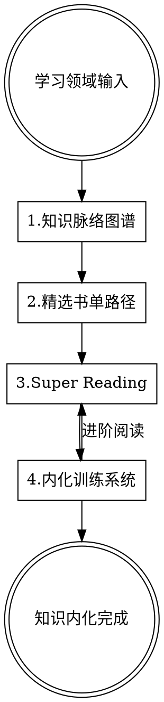
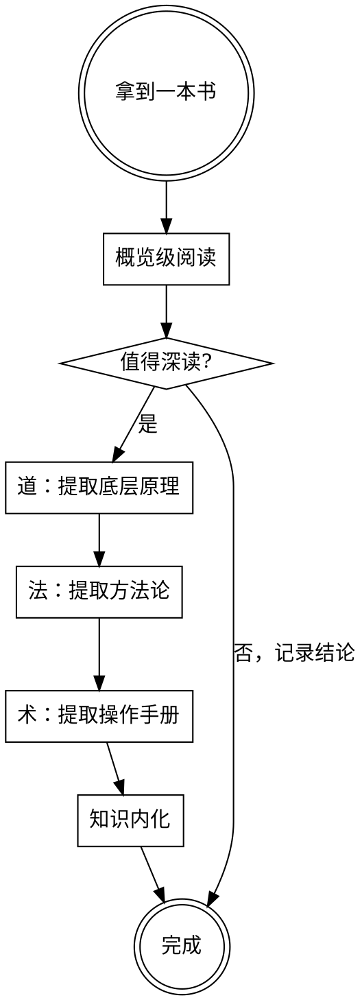
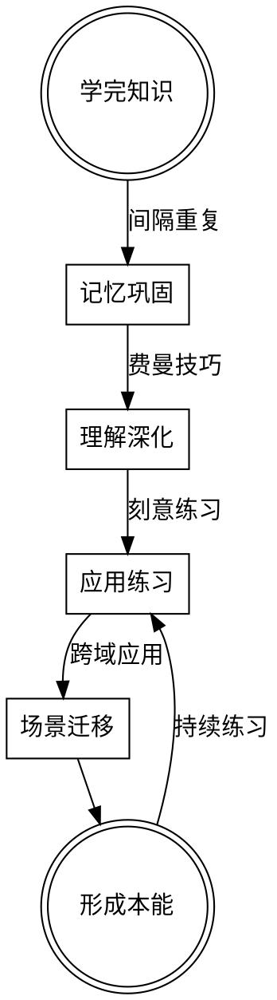

# 快速学习系统

## 概述

帮助你快速、系统、深度地掌握一个新领域的知识。不只是"知道"，而是真正理解原理、建立知识网络、内化成思维本能。

**核心理念：**
- 未来竞争力 = 快速学习能力 + 跨学科综合认知力
- 理解事物的本来原理，而非表面知识
- 知识要形成"肌肉记忆"，能自动调用、跨场景迁移

## 使用方式

**输入（三种方式皆可）：**
1. **明确领域：** "我想学习行为经济学"
2. **模糊目标：** "我想更好地说服别人"
3. **生活场景：** "我最近在带团队，但总觉得管不好"

**智能识别：** 当你给出模糊目标或场景时，我会：
1. 分析你的真实需求是什么
2. 识别需要学习的核心领域（可能不止一个）
3. 判断各领域的优先级和学习顺序
4. 解释为什么学这些领域能解决你的问题

**输出：**
1. 知识脉络图谱（主干 + 扩展 + 跨学科）
2. 精选书单（核心书 + 进阶路径）
3. 内化方法（形成肌肉记忆的练习）

**Sub Skill：** Super Reading - 快速深度理解一本书

## 模块0：学习需求识别

**当输入是模糊目标或场景时，先进行需求识别：**

**分析框架：**
```
场景/目标输入
├── 表面需求：用户说的是什么
├── 深层需求：用户真正想解决什么问题
├── 能力缺口：解决这个问题需要什么能力
├── 知识领域：这些能力对应什么知识领域
└── 学习优先级：先学什么、后学什么
```

**输出格式：**
```
学习需求识别：

你的场景/目标：[原话]

需求分析：
- 表面需求：[XX]
- 深层需求：[XX]
- 核心问题：[XX]

需要学习的领域：
1. [领域A]（优先级：高）
   - 为什么需要学：[XX]
   - 能解决什么问题：[XX]

2. [领域B]（优先级：中）
   - 为什么需要学：[XX]
   - 能解决什么问题：[XX]

建议学习顺序：[领域A] → [领域B] → ...
原因：[XX]

确认：以上分析是否符合你的需求？我们从哪个领域开始？
```

## 学习理论基础

- **第一性原理思维** - 回归本质，从基础原理推导
- **知识树模型** - 先建主干，再长枝叶
- **刻意练习** - 针对性重复，突破舒适区
- **间隔重复** - 科学的记忆巩固方法
- **费曼技巧** - 用教别人的方式检验理解
- **迁移学习** - 把知识应用到新场景

## 四大模块



## 模块1：知识脉络图谱

**核心目标：** 帮你看清一个领域的全貌——什么是主干、什么是枝叶、和其他领域有什么关联。

**知识树模型：**

```
知识领域
├── 第一性原理（这个领域最底层的假设/公理是什么）
├── 核心概念（必须理解的基础概念，通常3-7个）
├── 主干理论（领域内最重要的理论框架）
├── 方法论（这个领域解决问题的典型方法）
├── 经典应用（理论如何应用到实践）
└── 前沿发展（领域的最新进展和争议）
```

**跨学科关系图谱：**

```
                    [上游学科]
                    理论基础来源
                         ↓
[平行学科] ←——→ 【目标领域】 ←——→ [平行学科]
相似底层逻辑              相似底层逻辑
                         ↓
                    [下游应用]
                    知识应用领域
```

**输出格式：**
```
知识脉络图谱：[领域名称]

【第一性原理】
这个领域最底层的假设/公理：
- [原理1]：[解释]
- [原理2]：[解释]

【核心概念】（必须先理解这些，否则后面都是空中楼阁）
1. [概念A]：[一句话定义] - [为什么重要]
2. [概念B]：[一句话定义] - [为什么重要]
3. [概念C]：[一句话定义] - [为什么重要]

【主干理论】（领域内最重要的理论框架）
1. [理论A]
   - 核心观点：[XX]
   - 解决什么问题：[XX]
   - 局限性：[XX]

2. [理论B]
   - 核心观点：[XX]
   - 解决什么问题：[XX]
   - 局限性：[XX]

【方法论】（这个领域解决问题的典型方法）
- [方法1]：[适用场景] - [基本步骤]
- [方法2]：[适用场景] - [基本步骤]

【跨学科关系】

上游学科（理论基础来源）：
- [学科A]：提供了[XX]基础，比如[具体概念/理论]
- [学科B]：提供了[XX]基础，比如[具体概念/理论]

下游应用（知识应用领域）：
- [领域A]：应用了[XX]原理来解决[XX]问题
- [领域B]：应用了[XX]原理来解决[XX]问题

平行关联（相似底层逻辑）：
- [领域A]：看似不相关，但都基于[XX]原理
- [领域B]：可以互相借鉴[XX]方法

【学习路径建议】
1. 先理解：[XX]（打地基）
2. 再掌握：[XX]（建主干）
3. 然后拓展：[XX]（长枝叶）
4. 最后关联：[XX]（连成网）

Supporting：[为什么这样梳理脉络]
```

## 模块2：精选书单路径

**核心目标：** 从海量书籍中筛选出真正讲透本质的书，设计从入门到精通的阅读路径。

**选书原则：**
- **原典优先**：优先选择领域奠基人的原著，而非二手解读
- **体系完整**：选能覆盖主干脉络的书，而非只讲某个点的书
- **经典验证**：经过时间检验的经典，而非畅销但浅薄的书
- **实践导向**：有方法论、有案例、能指导实践的书

**书籍分层：**

```
阅读路径
├── 入门书（1本）：建立整体认知，激发兴趣
├── 核心书（1-3本）：覆盖主干脉络，打好基础
├── 进阶书（2-4本）：深入特定方向，拓展视野
├── 原典（1-2本）：领域奠基之作，理解源头
└── 跨界书（1-2本）：跨学科关联，融会贯通
```

**输出格式：**
```
精选书单：[领域名称]

【入门书】（建立整体认知，1本即可）
📖 《[书名]》 - [作者]
- 为什么选这本：[XX]
- 这本书能给你：[XX]
- 阅读时间预估：[XX]
- 阅读建议：[XX]

【核心书】（覆盖主干脉络，必读）
📖 1.《[书名]》 - [作者]
- 覆盖的主干知识：[XX]
- 核心价值：[XX]
- 阅读顺序：第[X]本读
- 阅读建议：[XX]

📖 2.《[书名]》 - [作者]
- 覆盖的主干知识：[XX]
- 核心价值：[XX]
- 阅读顺序：第[X]本读
- 阅读建议：[XX]

【进阶书】（深入特定方向，按需选读）
📖 《[书名]》 - [作者]
- 深入方向：[XX]
- 适合谁读：[XX]
- 前置要求：需要先读完[XX]

【原典】（领域奠基之作，追根溯源）
📖 《[书名]》 - [作者]
- 历史地位：[XX]
- 为什么要读原典：[XX]
- 阅读难度：[高/中/低]
- 阅读建议：[XX]

【跨界书】（跨学科关联，融会贯通）
📖 《[书名]》 - [作者]
- 关联的学科：[XX]
- 能带来的新视角：[XX]

【阅读路径图】
```
[入门书] → [核心书1] → [核心书2] → [进阶书] → [原典]
                ↓
           [跨界书]（可并行阅读）
```

【避坑指南】
不推荐的书：
- 《[书名]》：[为什么不推荐]

Supporting：[选书逻辑]
```

## 模块3：Super Reading（快速深度阅读）

**核心目标：** 快速理解一本书的核心观点，用"道法术"框架提取精华，建立与知识脉络的关联。

**核心框架：道法术三层结构**

```
道（原理层）：这个领域最底层的原理/公理是什么？为什么？
     ↓ 推导出
法（方法论层）：基于原理，应该怎么思考问题？判断标准是什么？
     ↓ 具体化为
术（操作层）：具体怎么做？步骤是什么？检查点是什么？
```

**阅读层次：**

| 层次 | 目标 | 重点 | 适用场景 |
|-----|------|-----|---------|
| **概览级** | 判断是否值得深读 | 核心观点、目标读者 | 快速筛选 |
| **道法术级** | 提取完整知识结构 | 道→法→术的推导关系 | 系统学习 |

**Super Reading 流程：**



---

### 概览级阅读

**阅读内容：**
1. 封面、封底、作者简介
2. 目录（仔细看）
3. 序言/前言
4. 每章的开头和结尾
5. 书评/推荐语

**输出格式：**
```
概览级阅读：《[书名]》

基本信息：
- 作者：[XX] - [作者背景/为什么有资格写这本书]
- 出版年份：[XX]
- 领域定位：[XX]

这本书讲什么：
[一段话概括，50字以内]

核心观点（3-5个）：
1. [观点1]
2. [观点2]
3. [观点3]

目标读者：
- 适合：[XX]
- 不适合：[XX]

与知识脉络的关系：
- 覆盖了哪些主干知识：[XX]
- 独特价值：[XX]

阅读判断：
- 是否值得深读：[是/否]
- 原因：[XX]
- 如果读，重点关注：[XX]
```

---

### 道法术级阅读

**核心原则：**
- **道**：提取2-4个底层原理，解释"为什么"
- **法**：从每个原理推导出方法论，解释"怎么想"
- **术**：把方法论具体化为操作手册，解释"怎么做"
- **关联**：清晰展示道→法→术的推导关系

**输出格式：**

```
道法术级阅读：《[书名]》

═══════════════════════════════════════════════════════════════
                           道（原理层）
═══════════════════════════════════════════════════════════════

【原理1：[原理名称]】
内容：[这个原理说的是什么]
推导关系：
```
道：[原理名称]
 ↓ 推导出
法：[对应的方法论]
 ↓ 具体化为
术：[对应的操作规则]
```

【原理2：[原理名称]】
内容：[这个原理说的是什么]
推导关系：
```
道：[原理名称]
 ↓ 推导出
法：[对应的方法论]
 ↓ 具体化为
术：[对应的操作规则]
```

═══════════════════════════════════════════════════════════════
                           法（方法论层）
═══════════════════════════════════════════════════════════════

【方法论1：[方法论名称]】
来源于道：[对应的原理]
核心思想：[这个方法论的核心是什么]
判断标准：
- 如果[情况A] → [应该怎么做]
- 如果[情况B] → [应该怎么做]
- 如果[情况C] → [应该怎么做]
通向术：[这个方法论对应哪些具体操作]

【方法论2：[方法论名称]】
...

═══════════════════════════════════════════════════════════════
                           术（操作层）
═══════════════════════════════════════════════════════════════

【术1：[操作主题] 完整操作手册】

#### 1.1 [子主题A]

**[操作类型]：**
| 要素 | 标准 | 自检方法 |
|-----|------|---------|
| [要素1] | [具体标准] | [如何检查] |
| [要素2] | [具体标准] | [如何检查] |

#### 1.2 [子主题B]

**[阶段名称]：**
| 步骤 | 动作 | 关键点 | 常见错误 |
|-----|------|-------|---------|
| 1 | [具体动作] | [注意什么] | [容易犯什么错] |
| 2 | [具体动作] | [注意什么] | [容易犯什么错] |

#### 1.3 常见错误诊断表

| 现象 | 可能原因 | 解决方法 |
|-----|---------|---------|
| [错误现象1] | [原因分析] | [具体解决步骤] |
| [错误现象2] | [原因分析] | [具体解决步骤] |

#### 1.4 进阶与变体

| 变体 | 适用场景 | 与基础版的区别 |
|-----|---------|---------------|
| [变体1] | [什么时候用] | [有什么不同] |

---

【术2：[操作主题] 完整操作手册】
...

═══════════════════════════════════════════════════════════════
                        道法术关联总图
═══════════════════════════════════════════════════════════════

```
┌─────────────────────────────────────────────────────────────────┐
│                           道（原理）                              │
├─────────────────────────────────────────────────────────────────┤
│  [原理1]    [原理2]    [原理3]    [原理4]                         │
└───────┬───────────┬─────────┬─────────┬─────────────────────────┘
        │           │         │         │
        ▼           ▼         ▼         ▼
┌─────────────────────────────────────────────────────────────────┐
│                           法（方法论）                            │
├─────────────────────────────────────────────────────────────────┤
│  [方法论1]   [方法论2]   [方法论3]   [方法论4]                      │
└───────┬───────────┬─────────┬─────────┬─────────────────────────┘
        │           │         │         │
        ▼           ▼         ▼         ▼
┌─────────────────────────────────────────────────────────────────┐
│                           术（操作）                              │
├─────────────────────────────────────────────────────────────────┤
│  [操作1]  [操作2]  [操作3]  [操作4]  [操作5]  [操作6]               │
└─────────────────────────────────────────────────────────────────┘
```

═══════════════════════════════════════════════════════════════
                         知识关联
═══════════════════════════════════════════════════════════════

与其他领域的关联：
- 与[领域A]的关联：[XX]
- 与[领域B]的关联：[XX]

一句话总结：
这本书最核心的一句话：[XX]
```

---

### 术层展开原则

**术的展开必须做到：**

1. **可执行**：每个步骤都具体到"做什么动作"
2. **可检查**：每个步骤都有"如何判断做对了"
3. **可诊断**：常见错误都有"现象→原因→解决方法"
4. **有层次**：从准备→执行→检查→进阶，完整覆盖

**术的标准结构：**
```
【术X：[主题] 完整操作手册】

X.1 准备阶段
- 需要什么条件/工具/前置知识
- 如何设置/配置

X.2 执行阶段
- 分步骤的具体动作
- 每步的关键点和常见错误

X.3 检查阶段
- 如何判断做对了
- 自检清单

X.4 常见错误诊断
- 错误现象 → 原因 → 解决方法

X.5 进阶与变体
- 基础版掌握后的进阶选项
```

## 模块4：内化训练系统

**核心目标：** 把知识从"知道"变成"本能"——思维模式内化、知识随时调用、跨场景迁移。

**内化的三个层次：**

| 层次 | 状态 | 特征 | 训练方法 |
|-----|------|-----|---------|
| **记住** | 能回忆起来 | 需要努力回想 | 间隔重复 |
| **理解** | 能解释给别人 | 能用自己的话说 | 费曼技巧 |
| **内化** | 自动调用 | 遇到问题自然想到 | 刻意练习 + 场景迁移 |

**内化训练体系：**



---

### 训练方法1：间隔重复（记忆巩固）

**原理：** 在遗忘曲线的关键节点复习，用最少的时间达到最好的记忆效果。

**复习节点：**
- 学完当天：快速回顾
- 第2天：简要复习
- 第7天：系统复习
- 第30天：深度复习
- 第90天：综合检验

**操作方法：**
1. 把核心概念、方法论做成卡片
2. 每张卡片正面是问题/概念名，背面是答案/解释
3. 按间隔时间复习，能答出来的延长间隔，答不出来的缩短间隔

---

### 训练方法2：费曼技巧（理解深化）

**原理：** 如果你不能用简单的话解释一个概念，说明你还没真正理解它。

**操作步骤：**
1. **选择概念**：选一个你学到的核心概念
2. **假装教学**：假装你要教一个完全不懂的人，用最简单的话解释
3. **发现卡点**：解释不清楚的地方，就是你没真正理解的地方
4. **回去学习**：针对卡点重新学习
5. **简化再简化**：直到能用一句话说清楚

**输出格式：**
```
费曼练习：[概念名称]

我的解释（假装对方是小学生）：
[用最简单的话解释]

类比/比喻：
[用生活中的例子类比]

一句话总结：
[XX]

卡点记录：
- 解释时卡住的地方：[XX]
- 说明我还没理解：[XX]
- 需要重新学习：[XX]
```

---

### 训练方法3：刻意练习（应用练习）

**原理：** 在舒适区边缘反复练习，针对弱点刻意训练，获得即时反馈。

**练习类型：**

**类型1：概念应用题**
- 给一个场景，用学到的概念分析
- 目的：检验是否真正理解概念

**类型2：方法论实操**
- 用学到的方法论解决一个真实问题
- 目的：检验方法论是否掌握

**类型3：案例分析**
- 分析一个真实案例，用学到的框架解读
- 目的：训练分析能力

**类型4：反向推导**
- 给一个结论，推导出它背后的原理
- 目的：训练深度思考

**输出格式：**
```
刻意练习：[练习主题]

练习类型：[概念应用/方法实操/案例分析/反向推导]

题目：
[具体题目]

我的回答：
[XX]

参考答案/反馈：
[XX]

差距分析：
- 做得好的地方：[XX]
- 需要改进的地方：[XX]
- 暴露的知识盲点：[XX]

下一步：
[针对性的学习或练习]
```

---

### 训练方法4：场景迁移（跨域应用）

**原理：** 把学到的原理应用到完全不同的场景，是检验真正理解的最好方式。

**迁移练习：**
1. **同领域迁移**：把原理应用到同领域的不同问题
2. **跨领域迁移**：把原理应用到完全不同的领域
3. **逆向迁移**：从其他领域找到相似的原理

**输出格式：**
```
场景迁移练习：[原理/概念名称]

原始领域：[XX]
原始应用：[XX]

迁移场景1：[新领域/新场景]
- 如何应用：[XX]
- 需要调整的地方：[XX]
- 新的洞察：[XX]

迁移场景2：[新领域/新场景]
- 如何应用：[XX]
- 需要调整的地方：[XX]
- 新的洞察：[XX]

逆向迁移：
- 在[XX]领域发现了类似的原理：[XX]
- 可以互相借鉴的地方：[XX]
```

---

### 内化检验清单

**你真正内化了一个知识，应该能做到：**

- [ ] **随时调用**：别人问起，能立刻说出核心要点，不用翻书
- [ ] **简单解释**：能用一句话或一个比喻让外行人理解
- [ ] **识别场景**：遇到问题时，能自动想到"这可以用XX原理分析"
- [ ] **灵活应用**：能把原理应用到从没见过的新场景
- [ ] **发现关联**：能看到这个知识和其他领域的联系
- [ ] **质疑边界**：知道这个原理的适用范围和局限性

**输出格式：**
```
内化训练计划：[领域名称]

【本周训练重点】
核心概念：[XX]
训练目标：从[记住/理解]提升到[理解/内化]

【每日训练安排】
Day 1：间隔重复 - 复习[XX]概念卡片
Day 2：费曼练习 - 解释[XX]概念
Day 3：刻意练习 - 完成[XX]应用题
Day 4：场景迁移 - 把[XX]应用到[新场景]
Day 5：综合检验 - 用内化检验清单自测

【训练记录】
| 日期 | 训练内容 | 完成情况 | 发现的问题 |
|-----|---------|---------|-----------|
| | | | |

【内化进度】
- [概念A]：[记住/理解/内化]
- [概念B]：[记住/理解/内化]
- [方法论A]：[记住/理解/内化]
```

## 常见错误

**只读不练：**
- ❌ 看完书觉得懂了，但从不做练习
- ✅ 每学一个概念，至少做一次费曼练习和一次应用练习

**贪多嚼不烂：**
- ❌ 同时学很多领域，每个都浅尝辄止
- ✅ 一次专注一个领域，内化后再学下一个

**只记不用：**
- ❌ 背了很多概念，但遇到问题想不起来用
- ✅ 刻意练习场景迁移，训练"自动调用"的能力

**孤立学习：**
- ❌ 学的知识是孤立的点，串不成网
- ✅ 每学一个新知识，都要找到它和已有知识的关联

## 质量检查清单

- [ ] 知识脉络图谱完整（主干+跨学科）
- [ ] 书单有层次（入门→核心→进阶→原典）
- [ ] Super Reading 输出完整（概览→框架→精华）
- [ ] 内化训练有计划、有记录
- [ ] 能通过内化检验清单的自测