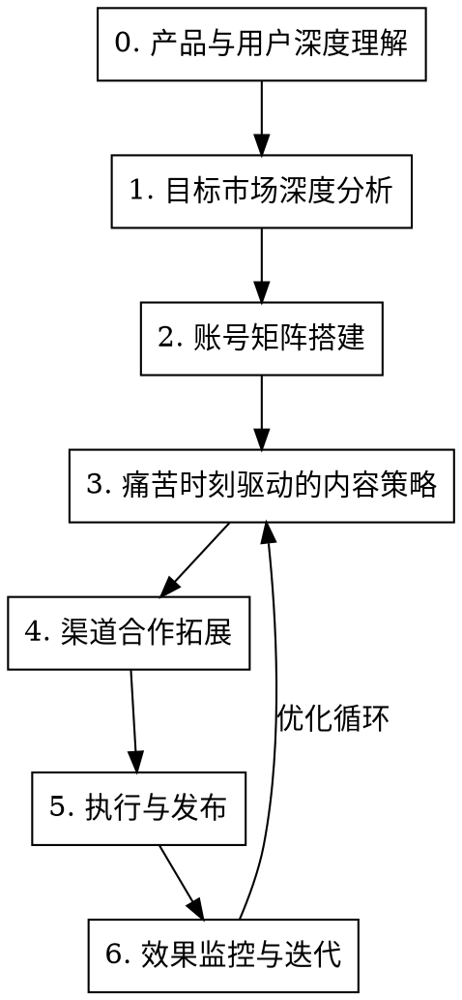

# SaaS内容营销与渠道合作

## Overview

**核心理念转变：**

❌ 错误思路：产品有什么功能 → 介绍功能 → 希望用户感兴趣
✅ 正确思路：用户在什么时刻痛苦 → 引发情绪共鸣 → 提供解决方案 → 产品自然带出

**内容营销的本质不是"介绍产品"，而是"在用户最痛苦的时刻出现，成为他们的解决方案"。**

## When to Use

**使用场景：**
- 需要制定社媒内容营销策略
- 要搭建账号矩阵并养号
- 要找渠道合作伙伴
- 需要针对不同海外市场制定本地化策略
- 需要评估和优化营销效果

**不适用：**
- 品牌广告投放（非内容营销）
- 线下活动策划

## 核心流程



---

## 0. 产品与用户深度理解

### 0.1 获取产品资料

| 优先级 | 资料类型 | 用途 |
|--------|----------|------|
| P0 | 用户手册/帮助文档 | 理解产品能做什么 |
| P0 | 产品官网/落地页 | 理解卖点包装 |
| P0 | **真实用户使用场景** | 理解用户为什么用、怎么用 |
| P1 | 竞品对比资料 | 理解差异化定位 |
| P2 | 客户反馈/案例 | 获取真实素材 |

### 0.2 核心使用场景拆解

**必须向用户确认：客户用这个产品主要做什么？列出2-5个核心场景。**

每个场景要拆解到具体：
- 谁在用？（角色画像）
- 在什么情况下用？（触发时机）
- 用来解决什么问题？（核心诉求）
- 如果不用会怎样？（痛苦后果）

### 0.3 痛苦时刻挖掘（关键）

**不是"痛点"，而是"痛苦时刻"——用户在什么具体时刻感到痛苦、恐惧、焦虑、愤怒？**

对每个使用场景，挖掘3-5个痛苦时刻：

```markdown
## 场景：[场景名称]

### 用户画像
- 谁：
- 规模/阶段：
- 核心诉求：

### 痛苦时刻清单
| 痛苦时刻 | 触发情境 | 用户情绪 | 内容切入角度 |
|----------|----------|----------|--------------|
| 账号突然被封，没有任何警告 | 早上打开后台发现 | 恐惧、愤怒 | "为什么你的账号突然被封？平台不会告诉你的真相" |
| 看到同行做得比自己好 | 刷到竞争对手的内容 | 焦虑、FOMO | "他们是怎么做到的？" |
| 花了钱买的东西没效果 | 投入后没有产出 | 后悔、怀疑 | "省了XX钱，亏了XX万——我的血泪教训" |
| 想扩展但不敢 | 看到机会但怕风险 | 犹豫、渴望 | "从1到10，中间隔着什么？" |
| 员工/合作方出问题 | 交接、权限、安全问题 | 担忧、烦躁 | "员工离职后，你的XX真的安全吗？" |
```

### 0.4 产品基础信息卡

```markdown
## 产品名称：[XX]

### 一句话定位
[产品是什么、给谁用、解决什么核心问题]

### 核心使用场景（按重要性排序）
1. [场景1]：[简述]
2. [场景2]：[简述]
3. [场景3]：[简述]

### 目标用户
| 用户角色 | 典型画像 | 核心诉求 | 在哪里聚集 |
|----------|----------|----------|------------|
| | | | |

### 竞品对比
| 维度 | 我们 | 竞品A | 竞品B |
|------|------|-------|-------|
| 价格 | | | |
| 核心差异 | | | |
| 目标市场 | | | |
```

---

## 1. 目标市场深度分析

### 1.1 市场差异不是语言，而是生态

**不同市场的差异：**
- **平台生态**：主流社媒平台不同
- **商业生态**：主流电商/服务平台不同
- **文化习惯**：信任建立方式、决策习惯不同
- **当前热点**：政策、经济、行业事件不同
- **价格敏感度**：消费能力、付费习惯不同

### 1.2 市场分析模板

**对每个目标市场，必须分析：**

```markdown
## 市场：[国家/地区]

### 市场环境
| 维度 | 情况 | 对内容策略的启示 |
|------|------|------------------|
| 主流电商平台 | | 内容要围绕这些平台的使用场景 |
| 主流社媒平台 | | 决定渠道优先级 |
| 支付习惯 | | 影响定价话术 |
| 创业/商业文化 | | 影响内容调性 |
| 信任建立方式 | | 决定需要什么类型的背书 |
| 价格敏感度 | | 影响是否强调性价比 |

### 当前热点（需要定期更新）
| 热点事件 | 内容结合点 |
|----------|------------|
| [平台政策变化] | "XX新政策来了，你需要知道这些" |
| [行业事件] | 借势分析 |
| [经济/汇率变化] | 性价比角度 |

### 渠道优先级
| 渠道 | 优先级 | 原因 | 内容形式 |
|------|--------|------|----------|
| | P0/P1/P2 | | |

### 用户聚集地
- 垂直社群：
- Facebook Groups：
- Telegram/WhatsApp群：
- 论坛：
```

### 1.3 渠道验证方法

**不要猜，要验证：**

1. **竞品渠道分析**：搜索"竞品名+review/评测"，看内容出现在哪
2. **社群渗透**：加入目标用户可能在的群组，观察他们分享什么
3. **逆向追踪**：问现有客户"您平时从哪里获取行业信息？"

---

## 2. 账号矩阵搭建与养号

### 2.1 账号矩阵架构

| 账号类型 | 人设 | 内容方向 | 数量建议 |
|----------|------|----------|----------|
| **品牌官方号** | 公司身份 | 产品动态、官方教程 | 1个 |
| **创始人/专家IP** | 行业专家 | 行业洞察、深度观点 | 1-2个 |
| **垂直场景号** | 特定场景专家 | 围绕核心使用场景的深度内容 | 2-3个 |
| **素人号** | 普通用户 | 真实使用体验、问题解决 | 3-5个 |

### 2.2 养号策略

**Phase 1：冷启动（1-2周）**
- 完善资料
- 正常浏览、点赞、评论
- 发布非营销内容

**Phase 2：权重积累（2-4周）**
- 发布原创干货内容
- 积极互动
- 参与热点话题

**Phase 3：正常运营**
- 20-30%内容软性植入产品
- 账号间协同配合

### 2.3 账号协同示例

```
【场景：用户痛苦时刻话题】

1. 素人号A发帖：
   "天塌了，我的XX被封了，有没有人遇到过？"

2. 专业号评论：
   "遇到过，后来我发现问题出在XX，我做了个视频讲这个"

3. 素人号B评论：
   "我试了XX方法，现在稳定运行了"

4. 官方号（适时）：
   "整理了一份防XX指南，私信领取"
```

---

## 3. 痛苦时刻驱动的内容策略

### 3.1 核心思维转变

| 维度 | ❌ 错误做法 | ✅ 正确做法 |
|------|------------|------------|
| 选题起点 | 产品有什么功能 | 用户在什么时刻痛苦 |
| 标题逻辑 | "XX功能介绍" | "你遇到过XX吗？" |
| 情绪触发 | 无/理性说服 | 恐惧、共鸣、FOMO、渴望 |
| 内容结构 | 功能→好处→使用方法 | 痛苦→共鸣→原因→方案→行动 |
| 产品植入 | 开头就介绍产品 | 自然带出，作为解决方案的一部分 |

### 3.2 选题公式

**基于痛苦时刻生成选题：**

| 痛苦时刻类型 | 选题公式 | 示例 |
|--------------|----------|------|
| 突发灾难 | "我的XX被封了/挂了/没了，这是我复盘的X个错误" | 故事+教训 |
| 隐藏风险 | "XX不会告诉你的真相" / "99%的人都不知道的XX" | 揭秘+警示 |
| 能力差距 | "他们是怎么做到XX的？" / "从X到Y，中间隔着什么？" | FOMO+方法 |
| 决策犹豫 | "XX到底值不值？我算了一笔账" | 理性分析 |
| 效率焦虑 | "别人X分钟搞定，你还在花X小时？" | 对比+技巧 |
| 血泪教训 | "省了XX钱，亏了XX万——我的血泪教训" | 故事+警示 |

### 3.3 情绪触发类型

| 情绪 | 触发方式 | 适用场景 |
|------|----------|----------|
| **恐惧** | 揭示潜在风险和后果 | 安全类、合规类产品 |
| **共鸣** | 描述用户经历过的痛苦 | 所有场景 |
| **FOMO** | 展示别人已经做到的成果 | 效率类、增长类产品 |
| **愤怒** | 揭露不公平或被隐瞒的事实 | 平台规则类话题 |
| **渴望** | 描绘达成目标后的状态 | 转化类内容 |
| **好奇** | 设置悬念或反常识 | 引流类内容 |

### 3.4 内容结构框架

#### YouTube/长视频结构（10-15分钟）

```
0:00 - 钩子：痛苦场景/问题
      "你的XX突然被封过吗？那种感觉..."

0:30 - 共鸣：扩大痛苦，说出观众心声
      "评论区告诉我，你有没有经历过..."

2:00 - 原因分析：为什么会这样
      "平台是怎么检测的？大多数人不知道..."

5:00 - 解决方案框架：方法论（不急着推产品）
      "要解决这个问题，需要做到这3点..."

8:00 - 具体操作：展示如何做到
      "我来演示具体怎么操作..."
      （这里自然引入产品）

12:00 - 案例/证明：真实效果
       "用这个方法之后..."

14:00 - 行动号召
       "链接在描述区..."
```

#### 短视频结构（15-60秒）

```
0-3秒：冲突/问题（必须抓人）
"你的XX又被封了？"

3-15秒：快速揭示原因
"因为平台能看到这3个东西..."

15-45秒：解决方案（简洁）
"解决方法其实很简单..."

45-60秒：行动号召
"评论'教程'我私发详细方法"
```

#### 图文轮播结构

```
第1张：冲击性标题+数字
"90%的人不知道的XX真相"

第2-6张：逐步揭示内容
每张一个点，配图说明

第7张：解决方案预告
"下一篇告诉你怎么解决"

第8张：行动号召
"关注+收藏，不错过干货"
```

### 3.5 选题库模板

**按使用场景组织选题，而非按功能：**

```markdown
## 场景：[场景名称]

### 引流层内容（60%）- 引发共鸣和兴趣
| 选题 | 钩子类型 | 情绪触发 | 平台 |
|------|----------|----------|------|
| "我的XX被封了，复盘5个致命错误" | 故事+教训 | 恐惧+共鸣 | YouTube |
| "XX不会告诉你的封号真相" | 揭秘 | 好奇+愤怒 | 全平台 |
| "还在用XX？醒醒吧" | 挑战认知 | 警醒 | 短视频 |

### 方案层内容（30%）- 提供解决方法
| 选题 | 内容类型 | 平台 |
|------|----------|------|
| "从1到10，我是这样做到的" | 方法论 | YouTube |
| "XX场景完整操作指南" | 教程 | YouTube |

### 信任层内容（9%）- 建立专业权威
| 选题 | 内容类型 | 平台 |
|------|----------|------|
| "XX行业2024年趋势分析" | 洞察 | 长文 |
| "XX公司是如何解决这个问题的" | 案例 | YouTube/长文 |

### 转化层内容（1%）- 直接推动购买
| 选题 | 内容类型 | 平台 |
|------|----------|------|
| "XX vs YY vs ZZ 深度对比" | 评测 | YouTube |
```

---

## 4. 渠道合作拓展

### 4.1 KOL合作思路

**不是找粉丝最多的，而是找"用户信任的人"：**

| KOL类型 | 特点 | 合作价值 |
|---------|------|----------|
| 垂直领域培训师 | 用户信任度高 | 精准获客 |
| 实战派博主 | 有真实案例 | 可信背书 |
| 行业社群群主 | 掌握精准用户 | 社群渗透 |

### 4.2 社群渗透策略

| 策略 | 做法 | 注意事项 |
|------|------|----------|
| 价值先行 | 先回答问题、提供帮助 | 不要上来就推广 |
| 建立人设 | 以专家身份持续输出 | 需要时间积累 |
| 资源置换 | 提供工具/资料换取关注 | 资源要有真实价值 |

---

## 5. 竞品监控

### 5.1 监控维度

| 维度 | 具体监控项 |
|------|------------|
| 内容策略 | 发布频率、选题方向、爆款内容 |
| 渠道布局 | 新开拓的平台、合作KOL |
| 用户反馈 | 评论区、社群中的口碑 |
| 产品动态 | 新功能、定价变化 |

### 5.2 竞品可借鉴点提取

观察竞品时，重点记录：
- 哪些选题/内容表现好？为什么？
- 他们触达用户的渠道有哪些？
- 用户在评论区问什么问题？（=痛苦时刻）
- 用户抱怨什么？（=我们的机会）

---

## 6. 效果监控与迭代

### 6.1 指标体系

| 层级 | 指标 | 含义 |
|------|------|------|
| L1 北极星 | 注册/付费用户数 | 最终目标 |
| L2 过程 | 官网UV、转化率 | 诊断问题 |
| L3 执行 | 内容发布量、互动量、粉丝增长 | 日常管理 |

### 6.2 内容迭代机制

**每周复盘：**
- 哪些选题/内容表现好？提取共性
- 哪些表现差？分析原因
- 用户评论/私信中出现的新痛苦时刻
- 下周选题调整

**月度复盘：**
- 各场景内容的整体表现
- 渠道ROI对比
- 竞品新动态
- 内容策略调整

---

## Quick Reference

### 启动前必做
1. 理解产品核心使用场景（2-5个）
2. 挖掘每个场景的痛苦时刻（每场景3-5个）
3. 分析目标市场生态（不只是语言）
4. 确定渠道优先级

### 选题公式
```
痛苦时刻 + 情绪触发 + 解决方案暗示 = 好选题

示例：
"账号被封" + 恐惧 + 揭示原因 = "为什么你的账号总是被封？平台不会告诉你的真相"
"看到同行做大" + FOMO + 方法 = "他们是怎么从1家店做到10家店的？"
```

### 内容结构
```
长视频：钩子→共鸣→原因→方案→操作→案例→行动
短视频：问题(3s)→原因(12s)→方案(30s)→行动(15s)
图文：标题→逐步揭示→方案预告→行动号召
```

### 市场分析要点
```
不是：语言A → 语言B
而是：
- 平台生态不同（用户在哪里）
- 商业生态不同（用户用什么平台做生意）
- 文化习惯不同（如何建立信任）
- 当前热点不同（可以借势什么）
- 价格敏感度不同（如何定位价值）
```

---

## Common Mistakes

| 错误 | 正确做法 |
|------|----------|
| 内容像说明书，介绍功能 | 从用户痛苦时刻出发，引发共鸣 |
| 选题泛泛，没有具体场景 | 拆解到具体使用场景的具体痛苦时刻 |
| 市场差异只考虑语言 | 分析生态、文化、热点、价格敏感度 |
| 上来就推产品 | 先提供价值，产品作为解决方案自然带出 |
| 只看粉丝量选KOL | 找用户真正信任的人 |
| 内容平铺直叙没有情绪 | 使用情绪触发：恐惧、共鸣、FOMO等 |
| 所有市场同一套内容 | 根据市场热点和生态定制内容 |