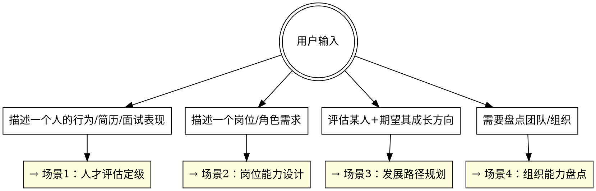
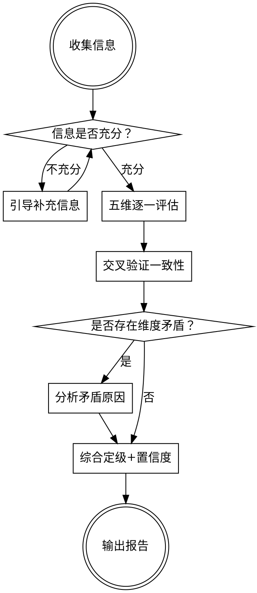

# AI时代人才底层能力识别体系

## 概述

**核心原则：** 在AI时代，经验可以被迅速拉平，对人的胜任能力评估从"你做了多少年"变为"你能自主解决多大范围的问题"。

本框架用 **问题解决自主范围** 替代传统的经验年限/职级体系，配合 **AI协同能力预期** 和三个辅助维度，形成五维能力矩阵，覆盖从执行者到合伙人的完整人才图谱。

**与传统体系的根本区别：**
- 传统体系：年限→职级→薪资，线性堆砌
- 本体系：自主性×判断力×影响力×AI协同 = 能力层级，维度交叉

**层级跃迁不是"做更多同样的事"，而是思维方式的质变。**

## 使用方式

**用户输入以下任一形式信息，触发对应场景：**



---

## 五维能力矩阵

### 维度总览

| 维度 | 权重 | 核心问题 |
|------|------|----------|
| **问题解决范围** | 30% | 他能自主搞定多大范围的事？ |
| **AI协同能力** | 30% | 他能用AI把自己放大到什么程度？ |
| **判断力与决策质量** | 15% | 他做出正确判断的比例和速度如何？ |
| **资源调度与影响力** | 13% | 他能调动多少人和资源？ |
| **主动性与自驱力** | 12% | 他在没有指令时会做什么？ |

### 维度1：问题解决范围（核心维度，权重30%）

**定义：** 在没有外部指导的情况下，此人能独立处理的问题的复杂度、模糊度和影响范围。

| 层级 | 问题解决范围 | 关键行为信号 |
|------|------------|-------------|
| **L1 执行者** | 给定任务100%完成。按手册规范执行常规事项，对机器/流程的重复产出做质检 | 能准确复述任务要求；按SOP无遗漏执行；发现偏差时能标记上报；交付物格式规范 |
| **L2 小组长** | 给定任务100%完成，对职责范围内大部分事有判断力，能灵活找出解决方案，分清优先级和是否需要上报。还能理解战略意图，自主定义加分事项 | 面对模糊任务不卡住，能自己找到路径；主动区分紧急vs重要；发现任务间矛盾能提出解决方案；完成规定动作后还能做"加分题" |
| **L3 经理** | 对给定的执行计划，能拆解任务、组织实施，判断实施中问题该直接处理还是上报调整计划。对执行计划的结果负责 | 能把模糊的计划拆成可执行的任务清单；分配任务时匹配人和事；过程中识别偏差并判断升级还是自行修正；主动同步进展和风险 |
| **L4 总监** | 对战略有极好的领悟力，给定方向后能完全自主规划——该找什么资源、安排什么人做什么事、制定执行步骤。对执行结果负责 | 能把战略翻译成3-6个月的作战地图；识别关键路径和资源瓶颈；建立反馈复盘机制；在执行中持续校准方向偏差 |
| **L5 合伙人** | 完全不需要指令，能自己找方向，"给个眼神就能交结果"。能为组织创造新的可能性 | 能在混沌中识别机会；提出的方向事后验证正确率高；能定义新业务/新打法；其他高层级人才愿意跟随 |

### 维度2：AI协同能力（核心维度，权重30%）

**定义：** 能在多大程度上将AI工具转化为自身能力的杠杆，而非仅仅作为效率工具使用。

| 层级 | AI协同能力预期 | 关键行为信号 |
|------|--------------|-------------|
| **L1** | 用AI优化机器运行效率或自身质检效率；尝试跨多环节的流程优化 | 能用AI辅助质检提升覆盖率；能用AI自动化重复性操作；能说出AI帮自己省了哪些时间 |
| **L2** | 了解其他部门的数据基础，借助大模型手搓取数或SOP解决时间卡点；尝试承担小型计划，调度AI和L1员工完成交付 | 不等别的部门提供数据，自己用AI拿到需要的信息；用AI起草SOP/流程文档；能把AI当"虚拟组员"分配任务 |
| **L3** | 大量跨部门工作不用等别人，了解其他部门数据基础，借助大模型手搓取数或SOP解决卡点，快速推动项目 | 用AI桥接部门间的信息差；用AI快速生成分析报告供决策；能指导下属使用AI提效；在项目瓶颈处用AI找替代方案 |
| **L4** | 跨部门以自身沟通为主；预判执行计划对人的能力要求和现有资源禀赋的gap，能自己或指挥人编写Skill，设置执行反馈复盘机制，紧跟计划落地质量和纠正偏差 | 能评估团队的AI成熟度并制定提升计划；用AI做能力gap分析；为关键流程设计AI协同的Skill和SOP；建立AI辅助的复盘机制 |
| **L5** | 用AI重新定义业务模式和组织形态；评估AI对行业格局的影响并据此制定战略 | 能判断哪些业务环节可以被AI重构；用AI探索新商业模式；在战略层面思考"AI原生"的组织设计 |

### 维度3：判断力与决策质量（辅助维度，权重15%）

**定义：** 在信息不完整的情况下，做出正确判断的概率和速度。

| 层级 | 判断力表现 | 关键行为信号 |
|------|----------|-------------|
| **L1** | 能判断产出是否符合标准（质检判断力），遇到标准外情况知道上报 | 能发现"不对劲"的产出；不自作主张修改超出权限的内容 |
| **L2** | 能在任务范围内分清轻重缓急，判断是否需要上报，知道什么时候该说"这个我搞不定" | 优先级排序合理；向上汇报的时机准确（不过早不过晚）；不在能力边界外硬扛 |
| **L3** | 能判断执行偏差是"正常波动"还是"需要调整计划"，知道什么问题自己处理、什么问题必须升级 | 区分战术调整vs战略偏离；处理突发事件时冷静有序；向上汇报时能附带解决方案建议 |
| **L4** | 能预判计划的风险点，评估人与事的匹配度，在多个"看起来都行"的选项中选出最优解 | 决策时考虑二阶效应；能识别"看起来好但实际有坑"的方案；对人的判断准确率高 |
| **L5** | 能在高度不确定性中做出方向性判断，判断的成功率随时间验证显著高于平均 | 在信息模糊时敢于下注；事后验证决策正确率高；能说清楚判断背后的逻辑框架 |

### 维度4：资源调度与影响力（辅助维度，权重13%）

**定义：** 能够调动的人、信息、资源的范围，以及对他人行为产生影响的能力。

| 层级 | 资源调度能力 | 关键行为信号 |
|------|------------|-------------|
| **L1** | 调度自己的时间和精力；能向直接上级清楚表达需求 | 时间管理有条理；能清楚说明需要什么支持 |
| **L2** | 调度AI工具+L1员工；能横向沟通获取信息，不完全依赖上级协调 | 能给L1成员分配任务并验收；跨组获取信息不一定走正式流程；同事愿意配合 |
| **L3** | 调度项目团队；能跨部门推动协作，解决资源冲突 | 项目成员执行到位；跨部门协作不卡在自己环节；能在资源不足时找到替代方案 |
| **L4** | 调度跨部门资源；能影响其他总监级别的人配合自己的计划 | 能说服平级或更高层级支持自己的方案；资源争夺中能达成双赢；团队成员成长可见 |
| **L5** | 调度组织内外部资源；吸引人才加入；影响行业合作伙伴 | 外部人才主动想加入；合作伙伴优先与其对接；能创造以前不存在的资源组合 |

### 维度5：主动性与自驱力（辅助维度，权重12%）

**定义：** 在没有明确指令或监督时，自发采取行动创造价值的倾向和能力。

| 层级 | 主动性表现 | 关键行为信号 |
|------|----------|-------------|
| **L1** | 在规定范围内寻找效率提升空间；主动标记流程中的问题点 | 不只完成任务，还会说"这里可以改进"；主动学习工具的新功能 |
| **L2** | 完成规定动作后自主定义"加分题"；主动理解战略意图并将其转化为具体行动 | 不等安排，主动找事做；做的"加分题"确实对目标有帮助；会说"我觉得我们还应该做X" |
| **L3** | 主动发现执行计划的漏洞和改进空间；在问题出现前预防 | 在领导问之前就准备好了答案；建立预警机制而非事后救火；主动提出计划优化建议 |
| **L4** | 主动识别战略执行中的机会和风险；在组织需要之前就开始布局 | 在被要求之前就开始调研新方向；主动储备关键人才；能提出"我们应该做X"并给出完整论证 |
| **L5** | 主动为组织创造新可能性；在行业趋势变化前就开始布局 | 定义新方向并率先投入资源验证；创造性地解决组织面临的结构性问题；"别人还没看到的机会，他已经在做了" |

---

## 层级跃迁关键转折点

**从一个层级到下一个层级，不是量变，是质变。** 每个跃迁有一个核心转折点：

| 跃迁 | 核心转折 | 转折信号 | 卡点信号 |
|------|---------|---------|---------|
| **L1→L2** | 从"按规矩办"到"有判断地办" | 开始说"我觉得应该这样做"并且判断正确率>70% | 死板执行不变通，或变通但判断错误率高 |
| **L2→L3** | 从"管好自己的活"到"管好一群人的活" | 开始关心"别人的任务完成得怎么样"并能有效干预 | 自己很能干但带不动人，或只管分配不管验收 |
| **L3→L4** | 从"拆解和执行计划"到"制定计划" | 能从战略方向自主推导出执行路线图，且路线图经实践验证可行 | 执行力强但缺乏全局视角，或能规划但脱离实际 |
| **L4→L5** | 从"领悟战略"到"创造战略" | 开始提出老板没想到但事后验证正确的方向 | 是优秀的执行型将领，但等待命令才行动 |

**常见"假跃迁"辨别：**
- ❌ 嘴上会说高层级的话，但实际行为还在低层级 → 看"做了什么"，不看"说了什么"
- ❌ 在熟悉领域表现为高层级，换个领域就回落 → 需要在2个以上不同场景验证
- ❌ 在顺境中表现为高层级，遇到压力就回落 → 需要在压力场景下验证
- ❌ 一直在做高层级的事但效果不好 → 层级认定看结果，不看行为本身

---

## 评估中的常见误判

### 高估陷阱（容易把人看高了）

| 现象 | 实际情况 | 纠正方法 |
|------|---------|---------|
| 表达能力很强，说起来头头是道 | 说和做是两码事 | 要求举具体例子，追问细节，验证闭环（从行动到结果） |
| 在大平台做过大项目 | 平台光环 ≠ 个人能力 | 追问"你具体负责什么？去掉平台资源你还能做到吗？" |
| 简历上写了很多高级职责 | 可能是职位通胀或简历美化 | 深挖一个案例的全过程：遇到什么问题、怎么想的、做了什么、结果如何 |
| 以前在大公司管很多人 | 管理幅度≠管理能力 | 问"最近一次带团队搞砸了什么？怎么补救的？" |

### 低估陷阱（容易把人看低了）

| 现象 | 实际情况 | 纠正方法 |
|------|---------|---------|
| 不善表达，说话不成体系 | 可能是实干型，做比说强 | 看成果而非汇报能力；给具体问题让其解决而非让其演讲 |
| 在小公司/不知名公司 | 小平台逼出真能力 | 问"资源这么少，你怎么搞定的？"——答案往往比大厂经历更有含金量 |
| 换过很多行业/岗位 | 可能是跨界迁移能力强 | 问"每次换的时候，上手最快的是什么、最难的是什么？" |
| 年龄偏小但表现不错 | AI时代经验拉平效应 | 不以年龄设限，直接看问题解决范围和判断力 |

---

## 场景1：人才评估定级

### 使用方式

**用户输入：** 描述一个人的行为表现、简历、面试记录、日常观察（任意形式）

**输出：** 五维能力评估报告 + 综合定级

### 分析流程



### 引导式补充信息的问题清单

当用户提供信息不足以做出高置信度判断时，优先追问以下问题（按信息价值排序）：

1. **关键事件法：** "能描述一个他独立处理过的最复杂的事情吗？遇到什么困难，怎么处理的，结果怎样？"
2. **边界测试：** "有没有他搞不定、需要找人帮忙或上报的情况？是什么类型的事？"
3. **主动性信号：** "有没有他自己主动提出来做的事，不是上面安排的？"
4. **AI协同实例：** "他日常工作中怎么用AI？举个具体例子？"
5. **压力测试：** "遇到紧急情况或资源不够时，他通常怎么应对？"

### 输出模板

```
## 人才能力评估报告

### 基本信息
评估对象：[姓名/代号]
评估依据：[简历/面试记录/日常观察/行为描述]
信息充分度：[充分/基本充分/有限——对置信度的影响]

### 五维评估

#### 1. 问题解决范围：[L?]
- 定级依据：[具体行为证据]
- 上限信号：[表现出更高层级特征的行为]
- 下限信号：[暴露当前层级不稳固的行为]

#### 2. AI协同能力：[L?]
- 定级依据：[具体使用场景和效果]
- 当前模式：[把AI当什么用？效率工具/信息桥梁/能力杠杆/战略资产]
- 提升空间：[下一步可以怎么提升]

#### 3. 判断力与决策质量：[L?]
- 定级依据：[决策实例和正确率]
- 判断盲区：[容易在什么类型的判断上犯错]

#### 4. 资源调度与影响力：[L?]
- 定级依据：[实际调动资源的范围和效果]
- 影响力来源：[靠什么影响别人——职权/专业/人格/利益]

#### 5. 主动性与自驱力：[L?]
- 定级依据：[主动行为实例]
- 驱动源：[被什么驱动——成就感/好奇心/责任感/竞争意识]

### 综合评估

综合能力层级：[L?]
置信度：[高/中/低]
置信度说明：[为什么是这个置信度]

维度一致性分析：
- [各维度得分是否一致？如果不一致，说明原因]
- [例如：问题解决范围L3但资源调度L2，可能是"自己能干但还没学会带人"]

高估/低估风险提示：
- [基于误判陷阱章节，提示可能的评估偏差]

### 评估建议
- 如需验证：[建议通过什么方式进一步验证]
- 发展建议：[此人最需要突破的是哪个维度]
```

---

## 场景2：岗位能力要求设计

### 使用方式

**用户输入：** 描述一个岗位/角色需要做的事

**输出：** 岗位能力画像 + 各维度最低要求 + AI协同能力设计

### 输出模板

```
## 岗位能力画像

### 岗位基本信息
岗位名称：[名称]
岗位核心价值：[一句话说明这个岗位在组织中的核心交付]

### 五维能力要求

| 维度 | 最低要求 | 理想水平 | 为什么需要这个级别 |
|------|---------|---------|------------------|
| 问题解决范围 | L? | L? | [基于岗位核心挑战的推理] |
| AI协同能力 | L? | L? | [基于岗位效率杠杆的推理] |
| 判断力与决策质量 | L? | L? | [基于岗位决策场景的推理] |
| 资源调度与影响力 | L? | L? | [基于岗位协作范围的推理] |
| 主动性与自驱力 | L? | L? | [基于岗位自主性要求的推理] |

### AI协同能力详细设计
这个岗位的人应该怎么用AI：
1. [必须能做到的AI协同场景]
2. [期望能做到的AI协同场景]
3. [加分项AI协同场景]

### 面试/考察建议
针对此岗位的五维能力要求，建议通过以下方式验证：
- 问题解决范围：[考察方式]
- AI协同能力：[考察方式]
- 判断力：[考察方式]
- 资源调度：[考察方式]
- 主动性：[考察方式]

### 注意事项
- 常见高估风险：[这个岗位容易被什么样的人蒙过去]
- 常见低估风险：[这个岗位容易忽略什么样的好候选人]
```

---

## 场景3：人才发展路径规划

### 使用方式

**用户输入：** 某人当前评估 + 期望发展目标

**输出：** 从当前层级到目标层级的成长路径

### 分析流程

1. 确认当前各维度评估（如果未做过，先走场景1）
2. 确认目标层级
3. 识别各维度gap
4. 按gap大小排序（优先补最短板）
5. 为每个gap设计具体的成长行动
6. 设计验证里程碑

### 输出模板

```
## 人才发展路径规划

### 现状与目标
当前综合层级：[L?]
目标综合层级：[L?]
核心跃迁转折：[从"X"到"Y"的质变]

### Gap分析

| 维度 | 当前 | 目标 | Gap | 优先级 |
|------|------|------|-----|--------|
| 问题解决范围 | L? | L? | ? | [高/中/低] |
| AI协同能力 | L? | L? | ? | [高/中/低] |
| 判断力 | L? | L? | ? | [高/中/低] |
| 资源调度 | L? | L? | ? | [高/中/低] |
| 主动性 | L? | L? | ? | [高/中/低] |

### 成长路径（按优先级排序）

#### Gap 1：[维度名称] L?→L?
当前表现：[具体行为]
目标表现：[具体行为]
成长行动：
1. [具体可执行的行动]
2. [具体可执行的行动]
验证里程碑：[什么信号说明此gap已经补上]
预计观察周期：[多久可以看到变化]

#### Gap 2：[维度名称] L?→L?
（同上格式）

### 成长风险提示
- [此人在成长过程中可能遇到的卡点]
- [需要组织提供什么支持/环境]
- [什么信号说明成长路径需要调整]
```

---

## 场景4：组织能力盘点

### 使用方式

**用户输入：** 团队/组织人员信息（可以是逐人描述，也可以是整体情况概述）

**输出：** 组织能力分布图 + 关键缺口分析 + 储备建议

### 输出模板

```
## 组织能力盘点报告

### 能力分布总览

| 层级 | 人数 | 占比 | 健康标准 | 差距 |
|------|------|------|---------|------|
| L5 合伙人 | ? | ?% | 视业务需要 | [缺口/富余] |
| L4 总监 | ? | ?% | 每个关键方向1人 | [缺口/富余] |
| L3 经理 | ? | ?% | 每个L4下2-4人 | [缺口/富余] |
| L2 小组长 | ? | ?% | 业务骨干层 | [缺口/富余] |
| L1 执行者 | ? | ?% | 基础执行力保障 | [缺口/富余] |

### 各维度组织健康度

| 维度 | 组织整体水位 | 关键发现 |
|------|------------|---------|
| 问题解决范围 | [概述] | [亮点和短板] |
| AI协同能力 | [概述] | [亮点和短板] |
| 判断力 | [概述] | [亮点和短板] |
| 资源调度 | [概述] | [亮点和短板] |
| 主动性 | [概述] | [亮点和短板] |

### 关键缺口分析
1. [最关键的能力缺口是什么，影响什么业务]
2. [次关键的能力缺口]

### 潜在合伙人/总监储备
每个专长方向的储备情况：
- [方向1]：当前[有/无]储备，储备人选[姓名/代号]，当前层级[L?]，到L5/L4的gap分析
- [方向2]：同上

### 组织行动建议
1. **紧急补充：** [立即需要外部招聘的层级和能力]
2. **内部培养：** [可以通过发展路径提升的人]
3. **AI协同提升计划：** [各层级AI能力提升的优先事项]
4. **结构优化：** [层级分布是否需要调整]
```

---

## 与传统体系映射参考

| 本框架 | 传统职级（参考） | 核心差异 |
|--------|----------------|---------|
| L1 执行者 | 专员/助理 | 传统看学历年限，本框架看执行质量和AI使用意识 |
| L2 小组长 | 高级专员/主管 | 传统看年限晋升，本框架看判断力和自主加分行为 |
| L3 经理 | 经理 | 传统看管理幅度，本框架看任务拆解能力和AI协同推动力 |
| L4 总监 | 总监/VP | 传统看title和团队规模，本框架看计划制定能力和AI赋能体系建设 |
| L5 合伙人 | 合伙人/CXO | 传统看资历和股份，本框架看方向创造力和AI战略眼光 |

**映射注意：** 传统L4可能在本框架只有L2-L3，传统L1可能在本框架就是L2。年限和title不能直接映射，必须基于行为评估。

---

## 常见错误

**评估时：**
- ❌ 只看最近一次表现就定级 → ✅ 需要多个场景、多次行为交叉验证
- ❌ 不同维度混在一起谈 → ✅ 逐维度独立评估，最后综合
- ❌ 把"潜力"当"能力" → ✅ 潜力是预测，能力看已经做到的事

**用框架时：**
- ❌ 机械比对行为列表打勾 → ✅ 理解每个层级背后的思维方式质变
- ❌ 忽略AI协同维度 → ✅ AI时代这个维度的区分度越来越大
- ❌ 给一个人一个死的层级 → ✅ 层级是动态的，特别是在AI加速学习的背景下

## 质量检查清单

- [ ] 评估基于具体行为证据，而非印象或标签
- [ ] 五个维度都有独立评估，不缺维度
- [ ] 检查了高估和低估两个方向的误判风险
- [ ] 维度间的一致性和矛盾有分析
- [ ] AI协同能力的评估具体到使用场景，不是笼统的"会用AI"
- [ ] 给出了置信度说明，诚实承认信息不足的地方
- [ ] 发展建议可执行，不是空泛的"需要加强XX能力"