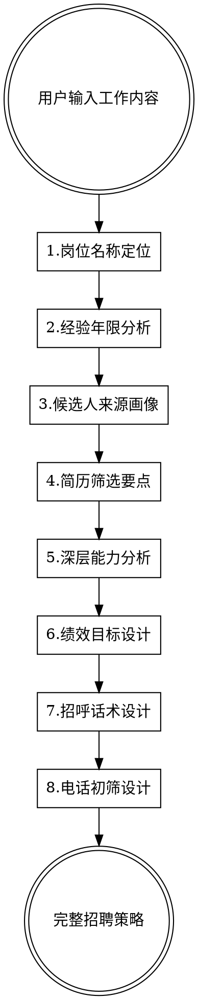

# 人才画像分析与招聘策略

## 概述

帮助创业公司快速找到、触达、筛选合适的人才。基于人才供应链思维，从"找到人-联系上-判断准"三个环节提供实用指导。

**核心原则：** 少理论、多实操；少模板、多针对性；每项分析都要有 Supporting 和分析逻辑。

## 使用方式

**用户输入：** "我需要一个人帮我做X"（只描述工作内容/职责）

**输出：** 八维度完整分析报告

## 理论框架（简要）

- **人才供应链思维**（Talent Supply Chain）- 人才从哪来、怎么触达、怎么转化
- **胜任力冰山模型**（Spencer & Spencer）- 区分表层技能和深层能力
- **人-岗-组织匹配**（P-J-O Fit）- 三维匹配而非单一技能匹配
- **行为事件访谈法**（BEI）- 通过过去行为预测未来表现
- **心理资本理论**（Luthans）- 自我效能、希望、韧性、乐观

## 八维度分析框架



## 维度1：岗位名称定位

**分析方法：**
- 根据工作内容提取核心价值产出
- 匹配市场通用岗位名称（便于候选人理解和搜索）
- 复合型岗位给出主名称 + 辅助说明

**输出格式：**
```
岗位名称：[市场通用名称]
岗位定位：[一句话说明这个岗位在公司的核心价值]
Supporting：[为什么选择这个名称，基于哪些工作内容判断]
分析逻辑：[从工作内容到岗位名称的推理过程]
```

## 维度2：工作经验年限

**分析方法：**
- 基于工作复杂度、独立性要求、决策权限推断
- 区分"总工作年限"和"相关领域经验"
- 创业公司特点：宁要3年高潜力者，不要10年螺丝钉

**输出格式：**
```
总体经验：[X-Y年]
核心经验：[具体领域需要Z年]
经验质量要求：[什么类型的经验更有价值]
Supporting：[为什么是这个年限范围]
分析逻辑：[从工作复杂度到经验要求的推理]
```

## 维度3：候选人来源画像 + 活跃圈子

**分析方法：**
- **公司类型分析**：什么行业、规模、发展阶段的公司培养这类人才
- **岗位路径分析**：候选人之前可能做过什么岗位
- **圈子分析**：这类人活跃在什么社群、论坛、线下活动

**输出格式：**
```
优先挖掘来源：
1. [公司类型] - [具体岗位] - [为什么这里的人合适]
2. [公司类型] - [具体岗位] - [为什么这里的人合适]

活跃圈子：
- [线上社群/论坛/平台]
- [线下活动/会议/组织]

Supporting：[基于什么判断这些来源是优质的]
分析逻辑：[从岗位需求到人才来源的推理]
```

## 维度4：简历筛选要点

**分析方法：**
基于前面分析的岗位需求、经验要求和来源画像，明确简历筛选时的关注重点和避雷信号。

**关注重点（加分项）：**
- **经历匹配度**：哪些公司背景、岗位经历是加分的
- **成果导向**：简历上哪些描述方式说明候选人有结果意识
- **成长轨迹**：什么样的职业发展路径是健康的
- **隐藏信号**：哪些细节能看出候选人的潜力

**避雷重点（减分项/红旗）：**
- **经历红旗**：哪些公司背景、岗位经历需要警惕
- **表述红旗**：简历上哪些描述方式暗示问题
- **稳定性红旗**：什么样的跳槽频率或职业路径需要关注
- **不匹配信号**：哪些特征说明候选人可能不适合创业公司

**输出格式：**
```
简历筛选要点：

关注重点（看到这些可以加分）：
1. [具体特征] - [为什么是加分项] - [如何在简历上识别]
2. [具体特征] - [为什么是加分项] - [如何在简历上识别]
3. [具体特征] - [为什么是加分项] - [如何在简历上识别]

避雷重点（看到这些要警惕）：
1. [具体特征] - [为什么是减分项] - [如何在简历上识别]
2. [具体特征] - [为什么是减分项] - [如何在简历上识别]
3. [具体特征] - [为什么是减分项] - [如何在简历上识别]

快速判断清单：
- 必须满足：[硬性条件，不满足直接pass]
- 优先考虑：[软性条件，满足越多越好]
- 谨慎对待：[需要在电话中进一步验证的点]

Supporting：[筛选标准的依据]
分析逻辑：[从岗位需求到筛选标准的推理]
```

## 维度5：深层能力分析

**核心原理：** 基于冰山模型，重点分析水面下的深层特质。根据工作内容推断需要的能力，而非让用户输入。

**分析四个层面：**

**思维方式：**
- 系统思维：能看到全局和关联
- 创新思维：能突破常规找到新方案
- 批判思维：能质疑假设、识别问题
- 结构化思维：能把复杂问题拆解清楚

**做事风格：**
- 主动性：不等安排，主动发现和解决问题
- 抗压性：压力下保持稳定产出
- 细致度：关注细节，减少返工
- 执行力：说到做到，按时交付

**学习能力：**
- 快速上手：短时间掌握新领域基础
- 深度钻研：能在专业领域持续精进
- 跨领域迁移：能把A领域经验用到B领域

**价值观：**
- 与创业公司文化的匹配度
- 对不确定性的接受度
- 对成长 vs 稳定的偏好

**理论依据：**
- 胜任力冰山模型（Spencer & Spencer）
- 成就动机理论（McClelland）
- 心理资本理论（Luthans）

**输出格式：**
```
深层能力画像：

思维方式：
- [能力名称]：[具体表现] - [为什么这个工作需要]

做事风格：
- [能力名称]：[具体表现] - [为什么这个工作需要]

学习能力：
- [能力名称]：[具体表现] - [为什么这个工作需要]

价值观匹配：
- [价值观]：[具体表现] - [为什么这个岗位需要]

Supporting：[从工作内容推断能力需求的依据]
分析逻辑：[工作挑战 → 所需能力的推理链条]
```

## 维度6：绩效贡献目标

**分析方法：**
- 基于岗位核心价值设计可衡量的绩效目标
- 区分短期（证明能力）、中期（产出价值）、长期（战略贡献）
- 创业公司特点：目标务实、可达成、能快速验证

**输出格式：**
```
绩效贡献目标：

入职前3个月（证明期）：
- [具体目标]：[衡量标准]

3-12个月（价值期）：
- [具体目标]：[衡量标准]

1年以上（战略期）：
- [具体目标]：[衡量标准]

Supporting：[目标设定的依据]
分析逻辑：[从岗位价值到绩效目标的推理]
```

## 维度7：个性化招呼话术

**核心原则：**
- **说人话**：不要HR腔，像朋友推荐机会
- **有钩子**：开头要有吸引力，让人想继续看
- **有诚意**：说清楚为什么找TA，不是群发
- **有行动**：明确下一步是什么

**话术设计依据：**
基于前面分析的候选人画像（来源、能力、价值观），推断候选人可能的痛点和诉求，设计针对性话术。

**三种场景：**

**Boss直聘/猎聘（简短有力）：**
- 50字以内
- 直击痛点或机会
- 一句话说清楚为什么值得聊

**LinkedIn/脉脉（专业有温度）：**
- 100字左右
- 体现对候选人背景的了解
- 说明为什么觉得TA合适

**微信/朋友介绍（自然破冰）：**
- 根据介绍人关系设计
- 自然不尴尬
- 降低防备心

**输出格式：**
```
话术设计：

候选人可能的痛点：[基于画像分析]
我们能提供的价值：[基于岗位分析]

Boss直聘版：
[具体话术]

LinkedIn/脉脉版：
[具体话术]

微信版（假设朋友介绍）：
[具体话术]

Supporting：[话术设计的心理学依据]
分析逻辑：[从候选人画像到话术设计的推理]
```

## 维度8：电话初筛设计

**场景定位：** 陌生电话沟通，候选人可能在工作中、通勤中或休息时接到电话，需要在5-15分钟内完成初步判断。

**沟通原则：**
- **像聊天不像审问**：用对话的方式，不是一问一答的面试
- **先建立连接**：开场要让对方放松，不要上来就问问题
- **顺着话题深入**：根据对方的回答自然追问，不要生硬切换话题
- **给对方说话的空间**：多用开放式问题，少用是非题
- **适时给反馈**：对方说完后给点回应，不要冷场

**电话结构设计：**

**开场（1-2分钟）：**
- 自我介绍 + 说明来意
- 确认对方是否方便
- 简单破冰，降低防备

**了解现状（3-5分钟）：**
- 了解对方目前的工作状态
- 了解对方看机会的动机
- 初步判断匹配度

**能力探测（5-8分钟）：**
- 用聊天的方式了解关键经历
- 通过具体案例判断深层能力
- 自然追问验证真实性

**双向沟通（2-3分钟）：**
- 简单介绍机会亮点
- 回答对方的问题
- 约定下一步

**输出格式：**
```
电话初筛脚本：

【开场白】
"喂，您好，请问是XX吗？我是XX公司的XX，之前在XX平台上看到您的简历/XX朋友推荐的您，想跟您聊聊，您现在方便吗？"

（如果方便）"好的，耽误您几分钟。我先简单说下，我们是做XX的，目前在找XX方向的人，看了您的背景觉得挺匹配的，想先电话聊聊，互相了解一下。"

【了解现状的问题】
1. 暖场问题：[自然的开场问题，让对方放松]
   - 话术示例："您现在还在XX公司是吧？那边现在怎么样？"
   - 目的：[这个问题想了解什么]
   - 听什么：[从回答中关注什么信息]

2. 动机问题：[了解对方看机会的原因]
   - 话术示例："您最近在看机会是有什么考虑吗？"
   - 目的：[这个问题想了解什么]
   - 听什么：[从回答中关注什么信息]

【能力探测的问题】
3. 经历问题：[了解关键工作经历]
   - 话术示例："我看您之前在XX做过XX，能跟我讲讲具体是怎么做的吗？"
   - 自然追问："那个项目最后效果怎么样？"/"过程中有遇到什么困难吗？"
   - 目的：[这个问题想了解什么]
   - 听什么：[从回答中关注什么信息]
   - 好的信号：[什么样的回答是加分的]
   - 警惕信号：[什么样的回答需要注意]

4. 深挖问题：[验证深层能力]
   - 话术示例："您刚才说XX，能具体说说当时是怎么想的吗？"
   - 自然追问："如果再来一次，您会有什么不同的做法吗？"
   - 目的：[这个问题想了解什么]
   - 听什么：[从回答中关注什么信息]

【收尾】
5. 期望问题：[了解对方的诉求]
   - 话术示例："您下一份工作最看重什么？有什么是必须满足的吗？"
   - 目的：判断期望匹配度

"好的，今天先聊到这里，我这边对您的背景还是很感兴趣的。我们这个岗位主要是XX，您听起来感觉怎么样？"

（如果对方有兴趣）"那我们约个时间详细聊聊？您看XX时间方便吗？"

【电话后判断】
通过/待定/不通过的判断标准：
- 通过：[什么情况下推进到下一轮]
- 待定：[什么情况下需要再考虑]
- 不通过：[什么情况下直接pass]

Supporting：[问题设计的依据]
分析逻辑：[从能力需求到问题设计的推理]
```

**问题设计技巧：**

**让问题更自然的方法：**
- ❌ "请描述一个你解决复杂问题的案例"
- ✅ "我看您之前做过XX项目，那个项目挺有意思的，能跟我讲讲吗？"

- ❌ "你如何处理工作压力？"
- ✅ "XX那个项目周期挺紧的吧？当时是怎么扛过来的？"

- ❌ "你的职业规划是什么？"
- ✅ "您下一步想往什么方向发展？"

**追问的艺术：**
- 用"然后呢"、"后来怎么样了"保持对话流畅
- 用"具体是怎么做的"深挖细节
- 用"当时是怎么想的"了解思考过程
- 用"如果再来一次"看反思能力

## 常见错误

**分析浅层化：**
- ❌ 只列技能要求，不分析深层能力
- ✅ 基于冰山模型深挖思维方式、做事风格、价值观

**来源分析空泛：**
- ❌ "可以在招聘网站上找"
- ✅ 具体到什么类型公司、什么岗位、什么圈子

**简历筛选没标准：**
- ❌ 凭感觉筛选，没有明确的加分项和减分项
- ✅ 有清晰的关注重点和避雷信号

**话术模板化：**
- ❌ 用通用的HR话术模板
- ✅ 基于候选人画像设计针对性话术

**电话沟通太干涩：**
- ❌ 像审问一样一问一答
- ✅ 像聊天一样自然对话，有开场、有过渡、有追问

**缺少分析逻辑：**
- ❌ 直接给结论，不说为什么
- ✅ 每项分析都有 Supporting 和推理过程

## 质量检查清单

- [ ] 八个维度都有完整分析
- [ ] 每个维度都有 Supporting 和分析逻辑
- [ ] 候选人来源具体到公司类型和岗位
- [ ] 简历筛选有明确的加分项和避雷项
- [ ] 深层能力从工作内容推断，不是套模板
- [ ] 话术针对候选人痛点设计
- [ ] 电话初筛脚本自然流畅，像聊天不像审问
- [ ] 电话问题有具体话术示例和判断标准